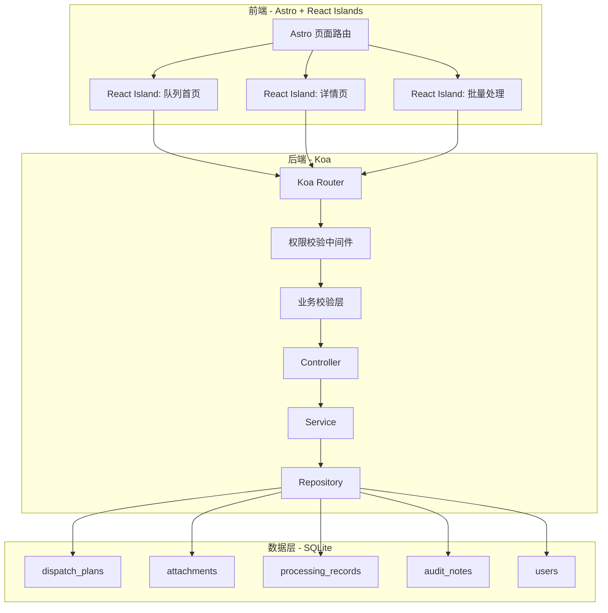
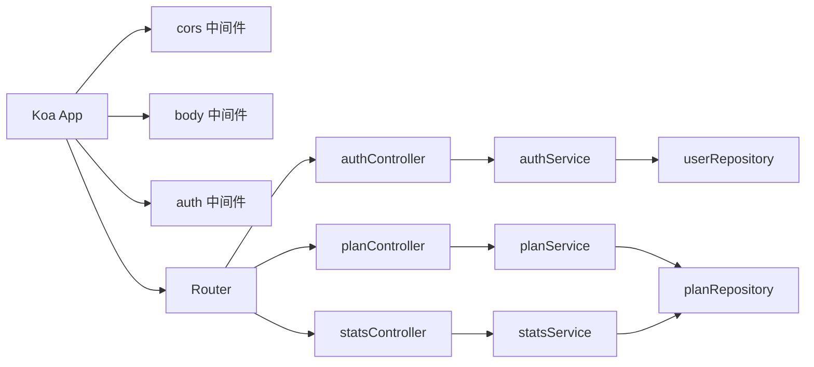
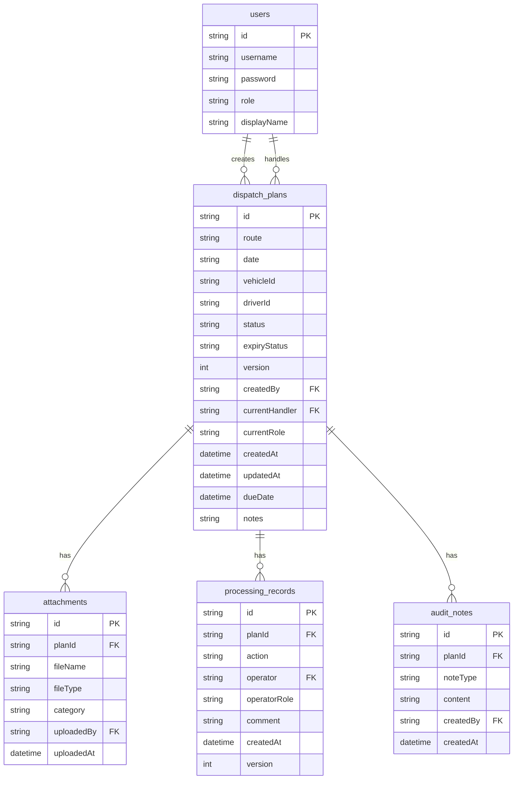

## 1. 架构设计



## 2. 技术说明

- 前端：Astro 5.x + React 18 Islands + TailwindCSS 3
- 后端：Node.js + Koa 2.x + koa-router + koa-body + koa-cors
- 数据库：SQLite3（better-sqlite3），项目内种子数据
- 端口：前端 3002，后端 8002
- 前端请求地址：http://localhost:8002/api
- CORS 白名单：http://localhost:3002

## 3. 路由定义

| 路由 | 用途 |
|------|------|
| / | 队列首页（发车计划队列 + 旁证摘要 + 预警分组） |
| /plan/:id | 发车计划详情页 |

## 4. API 定义

### 4.1 认证

```
POST /api/auth/login    { username, password } → { token, role, displayName }
GET  /api/auth/me       {} → { username, role, displayName }
```

### 4.2 发车计划

```
GET    /api/plans                    ?role=&status=&expiry=&page=&limit=  → { list, total, page }
GET    /api/plans/:id                → { plan, attachments, records, auditNotes }
POST   /api/plans                    { route, date, vehicleId, driverId, notes, attachments[] } → { id }
PUT    /api/plans/:id/advance        { action, comment, attachments[] } → { success }
PUT    /api/plans/:id/correct        { comment, attachments[] } → { success }
PUT    /api/plans/:id/reject         { reason } → { success }
POST   /api/plans/batch-advance      { planIds[], action, comment } → { results: [{ id, success, reason }] }
```

### 4.3 统计与预警

```
GET    /api/stats/expiry             → { normal: N, approaching: N, overdue: N }
GET    /api/stats/queue              ?role= → { pending: N, processing: N, completed: N }
```

### 4.4 旁证摘要

```
GET    /api/evidence/summary         → { vehicleScheduling: N, driverCheckIn: N, dispatchConfirm: N }
```

### 4.5 类型定义

```typescript
type ExpiryStatus = "normal" | "approaching" | "overdue"
type PlanStatus = "draft" | "pending_review" | "reviewing" | "pending_approval" | "approving" | "archived" | "returned"
type Role = "dispatcher" | "route_supervisor" | "ops_center"
type AuditAction = "created" | "submitted" | "reviewing" | "approved" | "rejected" | "corrected" | "archived"

interface DispatchPlan {
  id: string
  route: string
  date: string
  vehicleId: string
  driverId: string
  status: PlanStatus
  expiryStatus: ExpiryStatus
  version: number
  createdBy: string
  currentHandler: string
  currentRole: Role
  createdAt: string
  updatedAt: string
  dueDate: string
  notes: string
}

interface Attachment {
  id: string
  planId: string
  fileName: string
  fileType: string
  category: "vehicle_schedule" | "driver_checkin" | "dispatch_confirm" | "other"
  uploadedBy: string
  uploadedAt: string
}

interface ProcessingRecord {
  id: string
  planId: string
  action: AuditAction
  operator: string
  operatorRole: Role
  comment: string
  createdAt: string
  version: number
}

interface AuditNote {
  id: string
  planId: string
  noteType: "pending_sign" | "exception_return" | "sign_complete"
  content: string
  createdBy: string
  createdAt: string
}

interface User {
  id: string
  username: string
  password: string
  role: Role
  displayName: string
}
```

## 5. 服务端架构图



## 6. 数据模型

### 6.1 数据模型定义



### 6.2 数据定义语言

```sql
CREATE TABLE users (
  id TEXT PRIMARY KEY,
  username TEXT UNIQUE NOT NULL,
  password TEXT NOT NULL,
  role TEXT NOT NULL CHECK(role IN ('dispatcher', 'route_supervisor', 'ops_center')),
  display_name TEXT NOT NULL
);

CREATE TABLE dispatch_plans (
  id TEXT PRIMARY KEY,
  route TEXT NOT NULL,
  date TEXT NOT NULL,
  vehicle_id TEXT NOT NULL,
  driver_id TEXT NOT NULL,
  status TEXT NOT NULL DEFAULT 'draft' CHECK(status IN ('draft','pending_review','reviewing','pending_approval','approving','archived','returned')),
  expiry_status TEXT NOT NULL DEFAULT 'normal' CHECK(expiry_status IN ('normal','approaching','overdue')),
  version INTEGER NOT NULL DEFAULT 1,
  created_by TEXT NOT NULL REFERENCES users(id),
  current_handler TEXT NOT NULL REFERENCES users(id),
  current_role TEXT NOT NULL,
  created_at TEXT NOT NULL DEFAULT (datetime('now','localtime')),
  updated_at TEXT NOT NULL DEFAULT (datetime('now','localtime')),
  due_date TEXT NOT NULL,
  notes TEXT DEFAULT ''
);

CREATE TABLE attachments (
  id TEXT PRIMARY KEY,
  plan_id TEXT NOT NULL REFERENCES dispatch_plans(id),
  file_name TEXT NOT NULL,
  file_type TEXT NOT NULL,
  category TEXT NOT NULL CHECK(category IN ('vehicle_schedule','driver_checkin','dispatch_confirm','other')),
  uploaded_by TEXT NOT NULL REFERENCES users(id),
  uploaded_at TEXT NOT NULL DEFAULT (datetime('now','localtime'))
);

CREATE TABLE processing_records (
  id TEXT PRIMARY KEY,
  plan_id TEXT NOT NULL REFERENCES dispatch_plans(id),
  action TEXT NOT NULL CHECK(action IN ('created','submitted','reviewing','approved','rejected','corrected','archived')),
  operator TEXT NOT NULL REFERENCES users(id),
  operator_role TEXT NOT NULL,
  comment TEXT DEFAULT '',
  created_at TEXT NOT NULL DEFAULT (datetime('now','localtime')),
  version INTEGER NOT NULL
);

CREATE TABLE audit_notes (
  id TEXT PRIMARY KEY,
  plan_id TEXT NOT NULL REFERENCES dispatch_plans(id),
  note_type TEXT NOT NULL CHECK(note_type IN ('pending_sign','exception_return','sign_complete')),
  content TEXT NOT NULL,
  created_by TEXT NOT NULL REFERENCES users(id),
  created_at TEXT NOT NULL DEFAULT (datetime('now','localtime'))
);

CREATE INDEX idx_plans_status ON dispatch_plans(status);
CREATE INDEX idx_plans_expiry ON dispatch_plans(expiry_status);
CREATE INDEX idx_plans_handler ON dispatch_plans(current_handler);
CREATE INDEX idx_plans_role ON dispatch_plans(current_role);
CREATE INDEX idx_attachments_plan ON attachments(plan_id);
CREATE INDEX idx_records_plan ON processing_records(plan_id);
CREATE INDEX idx_audit_plan ON audit_notes(plan_id);
```
