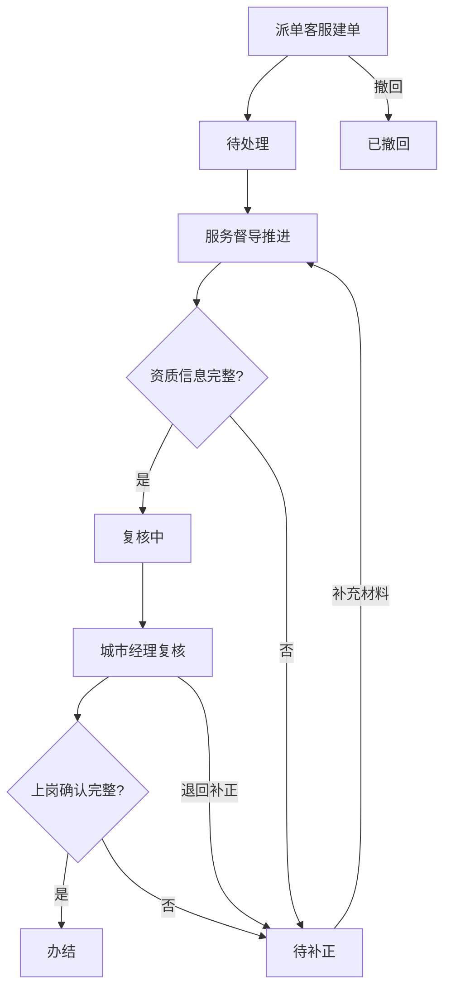

## 1. 产品概述

家政服务平台月底集中处理服务人员审核单系统，用于月底集中审核家政阿姨的档案、资质和上岗信息。系统覆盖派单客服建单→服务督导推进→城市经理复核全流程，支持状态流转、证据追踪、异常处理、到期预警和批量操作。

目标用户：家政服务平台运营团队（派单客服、服务督导、城市经理），月底集中处理大量服务人员审核单，确保合规、高效、可追溯。

## 2. 核心功能

### 2.1 用户角色

| 角色 | 登录方式 | 核心权限 |
|------|----------|----------|
| 派单客服 | 演示账号登录 | 创建审核单、查看自己的建单列表、撤回待处理单据 |
| 服务督导 | 演示账号登录 | 推进审核单（补充阿姨档案、资质审核信息）、退回补正、提交处理结果 |
| 城市经理 | 演示账号登录 | 复核审核单、确认上岗信息、办结或退回、查看统计 |

### 2.2 功能模块

1. **审核单列表页**：按角色队列展示审核单，支持筛选（状态/到期/角色），三队到期预警（正常/临期/逾期）
2. **审核单详情页**：阿姨档案、资质审核、上岗确认三模块，操作按钮（推进/退回/复核/办结），审计备注时间线
3. **批量处理页**：批量推进/复核/退回，逐条返回成功/失败原因
4. **到期预警看板**：正常/临期/逾期三队列，节点超时归属责任人，逾期批量推进逐条拦截

### 2.3 页面详情

| 页面名称 | 模块名称 | 功能描述 |
|----------|----------|----------|
| 审核单列表 | 角色队列 | 派单客服看"我创建的"，服务督导看"待推进"，城市经理看"待复核" |
| 审核单列表 | 状态筛选 | 按状态筛选：待处理、处理中、复核中、待补正、办结 |
| 审核单列表 | 到期预警标签 | 正常(绿)、临期(黄)、逾期(红)标签，不混合显示 |
| 审核单列表 | 批量操作栏 | 勾选后可批量推进/复核/退回，逐条返回结果 |
| 审核单详情 | 阿姨档案模块 | 姓名、身份证、联系方式、服务类型、工作经历 |
| 审核单详情 | 资质审核模块 | 健康证、培训证、背景调查、资质到期日期 |
| 审核单详情 | 上岗确认模块 | 上岗日期、服务区域、合同编号、确认状态 |
| 审核单详情 | 操作区域 | 按角色显示操作按钮，提交时校验权限和必填证据 |
| 审核单详情 | 审计备注时间线 | 展示所有处理记录，状态变更、补正动作、异常原因 |
| 批量处理结果 | 逐条结果列表 | 每条审核单的成功/失败状态和失败原因 |
| 到期预警看板 | 三队列视图 | 正常、临期（7天内到期）、逾期分区展示 |
| 到期预警看板 | 责任人归属 | 超时节点标注当前责任人 |
| 到期预警看板 | 逾期批量推进 | 逾期单据批量推进，逐条拦截不合法操作 |

## 3. 核心流程

### 3.1 正常流转

派单客服创建审核单（填写阿姨档案基本信息）→ 审核单状态变为"待处理" → 服务督导领取并推进（补充资质审核信息）→ 状态变为"复核中" → 城市经理复核（确认上岗信息）→ 状态变为"办结"

### 3.2 异常流转

- **缺材料**：服务督导发现缺少阿姨档案或资质信息，退回补正，状态变为"待补正"，记录异常原因
- **超时/逾期**：到期预警看板显示临期/逾期单据，节点超时算到当前责任人
- **退回补正**：城市经理退回，状态变为"待补正"，需记录补正要求和异常原因
- **状态冲突**：并发操作或旧版本提交时返回明确错误，不允许覆盖

### 3.3 流程图

## 4. 用户界面设计

### 4.1 设计风格

- 主色调：深青色(#0F766E)作为品牌色，搭配暖灰(#F5F5F4)背景
- 辅助色：状态色 - 绿色(正常#16A34A)、黄色(临期#EAB308)、红色(逾期#DC2626)
- 按钮风格：圆角(8px)、实心主操作按钮+描边次要按钮
- 字体：系统字体栈，标题加粗，正文常规
- 布局：左侧导航 + 右侧内容区，卡片式列表
- 图标：Lucide 图标库

### 4.2 页面设计概览

| 页面名称 | 模块名称 | UI元素 |
|----------|----------|--------|
| 审核单列表 | 顶部导航栏 | Logo、角色切换下拉、用户信息 |
| 审核单列表 | 筛选栏 | 状态筛选标签组、到期预警切换、搜索框 |
| 审核单列表 | 列表区 | 表格/卡片列表，状态徽章、到期标签、操作按钮 |
| 审核单列表 | 批量操作栏 | 底部固定栏，勾选计数、批量操作按钮 |
| 审核单详情 | 三模块Tab | 阿姨档案/资质审核/上岗确认Tab切换 |
| 审核单详情 | 操作区 | 右侧固定操作面板，含状态、按钮、审计备注 |
| 批量处理结果 | 结果弹窗 | 逐条结果列表，成功绿色勾/失败红色叉+原因 |
| 到期预警看板 | 三列看板 | 正常/临期/逾期三列，拖拽卡片式 |

### 4.3 响应式设计

桌面优先，最小宽度1024px，侧边栏可折叠，表格列可自适应。

## 5. 权限校验规则

权限校验在**提交处理结果时**进行，不仅仅依靠隐藏按钮：

| 操作 | 允许角色 | 校验条件 | 错误码 |
|------|----------|----------|--------|
| 创建审核单 | 派单客服 | 无 | - |
| 推进审核单 | 服务督导 | 当前状态为"待处理"或"待补正"，当前处理人为空或本人 | ERR_ROLE_MISMATCH / ERR_STATUS_CONFLICT / ERR_HANDLER_MISMATCH |
| 复核审核单 | 城市经理 | 当前状态为"复核中"，当前处理人为空或本人 | ERR_ROLE_MISMATCH / ERR_STATUS_CONFLICT / ERR_HANDLER_MISMATCH |
| 退回补正 | 服务督导/城市经理 | 当前状态允许退回 | ERR_STATUS_CONFLICT |
| 撤回审核单 | 派单客服 | 当前状态为"待处理"且创建人为本人 | ERR_ROLE_MISMATCH / ERR_STATUS_CONFLICT |
| 办结 | 城市经理 | 阿姨档案、资质审核、上岗确认三模块信息完整 | ERR_MISSING_EVIDENCE |

### 5.1 必填证据校验

提交处理结果时，系统检查审核单是否缺少：
- 阿姨档案：姓名、身份证、联系方式为必填
- 资质审核：健康证、培训证为必填
- 上岗确认：上岗日期、服务区域为必填

缺少任何必填项时返回 `ERR_MISSING_EVIDENCE`，并明确指出缺少哪些字段。

## 6. 到期预警规则

- **正常**：到期日 > 7天
- **临期**：到期日 ≤ 7天且 > 0天
- **逾期**：到期日 ≤ 0天（已过期）
- 节点超时归属：当前状态对应的责任人
  - 待处理 → 派单客服
  - 处理中/待补正 → 服务督导
  - 复核中 → 城市经理
- 逾期批量推进：逐条校验权限和状态，不合法的跳过并返回原因

## 7. 演示数据

### 7.1 演示账号

| 角色 | 账号 | 密码 |
|------|------|------|
| 派单客服 | dispatcher | demo123 |
| 服务督导 | supervisor | demo123 |
| 城市经理 | manager | demo123 |

### 7.2 四类演示单据

1. **正常流转单**：信息完整，可从待处理→复核中→办结
2. **缺材料单**：阿姨档案缺少身份证号，服务督导推进时被拦截
3. **超时/逾期单**：已过到期日，出现在逾期队列
4. **退回补正单**：已被退回，状态为"待补正"，需补充信息后重新提交
