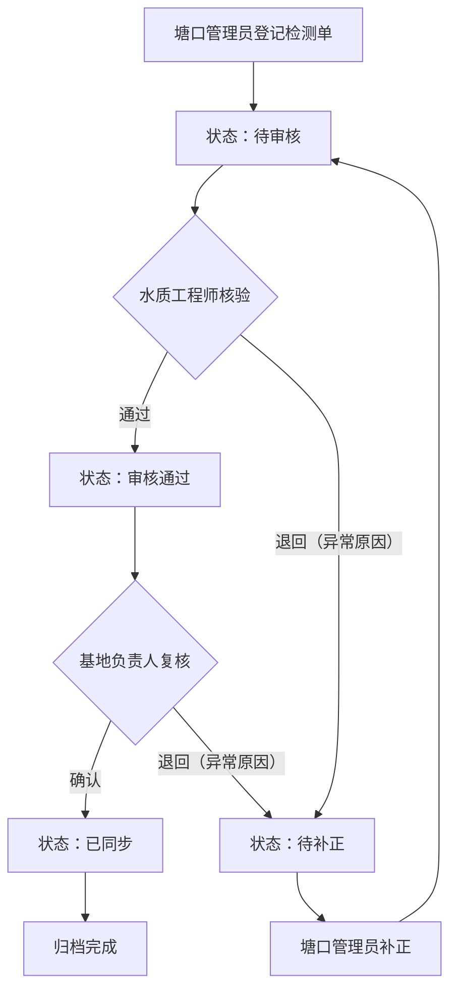

## 1. 产品概述

水产养殖基地月底集中处理水质检测单系统，面向水产养殖基地的塘口管理员、水质工程师和基地负责人，解决水质检测单从登记、核验到归档的全流程数字化管理问题。系统以水质检测单为核心驱动，通过严格的角色分工与状态流转控制，确保每份检测单按顺序处理、证据完整可溯、异常原因明确记录，杜绝越权操作与重复提交。

- 核心价值：将月底集中处理的纸质/散乱水质检测单数字化，实现流转可控、证据可查、异常可溯
- 目标用户：塘口管理员（登记入口数据）、水质工程师（核对过程）、基地负责人（确认结果）

## 2. 核心功能

### 2.1 用户角色

| 角色 | 进入方式 | 核心权限 |
|------|----------|----------|
| 塘口管理员 | 角色切换选择 | 登记水质检测单、上传附件、提交审核、补正退回单据 |
| 水质工程师 | 角色切换选择 | 核验检测过程、填写核验意见、通过/退回检测单、查看待处理队列 |
| 基地负责人 | 角色切换选择 | 复核检测结果、确认归档、批量复核通过、查看审计轨迹 |

### 2.2 功能模块

1. **水质检测单登记模块**：塘口管理员新建检测单，填写塘口编号、检测指标（pH/溶解氧/氨氮/亚硝酸盐等）、检测时间、附件证据，提交进入"待审核"状态
2. **过程核验模块**：水质工程师审核待审核单据，核对检测数据与标准值，填写核验意见，通过则推进至"审核通过"，退回则标记异常原因并回到待补正
3. **复核归档模块**：基地负责人对审核通过的单据进行最终复核确认，确认后状态变为"已同步"，支持批量复核
4. **到期预警队列**：按责任人计算节点超时，区分正常（绿色）、临期（黄色）、逾期（红色）状态，一目了然
5. **审计轨迹**：每份检测单的操作记录完整保留，包含操作人、角色、时间、动作、异常原因

### 2.3 页面详情

| 页面名称 | 模块名称 | 功能描述 |
|----------|----------|----------|
| 工作台首页 | 角色切换栏 | 顶部角色切换，切换后刷新对应角色可见的队列与操作 |
| 工作台首页 | 到期预警队列 | 按责任人展示正常/临期/逾期检测单，颜色区分，支持筛选 |
| 工作台首页 | 统计卡片 | 待审核/审核通过/已同步/逾期数量统计 |
| 水质检测单列表 | 列表区 | 支持按状态、塘口、日期、角色筛选，显示单号、塘口、指标、状态、当前处理人、到期状态 |
| 水质检测单列表 | 批量操作栏 | 勾选后批量处理，逐条返回成功/失败及原因 |
| 水质检测单详情 | 基本信息区 | 检测单号、塘口编号、检测时间、检测指标及数值 |
| 水质检测单详情 | 附件证据区 | 上传/查看附件，必填证据校验 |
| 水质检测单详情 | 处理流程区 | 按顺序显示：塘口管理员登记→水质工程师核验→基地负责人确认，当前节点高亮 |
| 水质检测单详情 | 办理区 | 当前角色可执行的操作按钮（提交/通过/退回/补正），操作后刷新详情 |
| 水质检测单详情 | 异常原因区 | 退回/补正时填写异常原因，历史异常原因保留显示 |
| 水质检测单详情 | 审计轨迹区 | 按时间倒序显示所有操作记录，含补正动作与异常原因 |
| 批量处理结果弹窗 | 结果列表 | 逐条显示成功/失败及失败原因（越权/重复提交/状态冲突/缺证据/旧版本等） |

## 3. 核心流程

### 3.1 正常流转

塘口管理员登记水质检测单并上传附件证据，提交后状态变为"待审核"。水质工程师从待审核队列中取出单据，核对检测数据与标准值，填写核验意见后通过，状态推进至"审核通过"。基地负责人对审核通过的单据进行最终复核确认，确认后状态变为"已同步"，完成归档。

### 3.2 异常流转

- **缺材料退回**：水质工程师或基地负责人发现证据不足，退回检测单并填写异常原因，状态变为"待补正"，塘口管理员补正后重新提交
- **超时/逾期**：到期预警队列按责任人计算节点超时，逾期单据标红显示；逾期批量推进逐条给拦截结果
- **状态冲突**：多人同时操作时，版本号校验拦截旧版本提交，返回明确错误

### 3.3 流程图

## 4. 用户界面设计

### 4.1 设计风格

- **主色调**：深海蓝 (#0A3D62) + 水清绿 (#1ABC9C)，体现水产养殖行业特色
- **辅助色**：状态色 - 待审核(琥珀 #F39C12)、审核通过(蓝 #3498DB)、已同步(绿 #27AE60)、逾期(红 #E74C3C)、临期(橙 #E67E22)
- **按钮风格**：圆角按钮，主操作用实心色，次操作用描边
- **字体**：思源黑体/Noto Sans SC，正文14px，标题18-24px
- **布局风格**：左侧导航 + 顶部角色切换 + 主内容区卡片布局
- **图标风格**：线性图标，与水产业务结合（鱼、水滴、检测仪等）

### 4.2 页面设计概览

| 页面名称 | 模块名称 | UI 元素 |
|----------|----------|---------|
| 工作台首页 | 角色切换栏 | 顶部横向三角色标签，当前角色高亮，切换后页面刷新 |
| 工作台首页 | 统计卡片 | 4张统计卡片横排，各带图标和数字，状态色区分 |
| 工作台首页 | 到期预警队列 | 表格形式，行背景色区分正常/临期/逾期，支持按状态筛选标签 |
| 水质检测单列表 | 列表区 | 表格+筛选栏，状态标签彩色，当前处理人列显示角色标签 |
| 水质检测单列表 | 批量操作栏 | 勾选复选框后底部浮出操作栏，显示选中数量与操作按钮 |
| 水质检测单详情 | 处理流程区 | 横向步骤条，三步展示处理顺序，当前节点高亮+脉冲动画 |
| 水质检测单详情 | 办理区 | 卡片内按钮组，退回时弹出异常原因填写框 |
| 水质检测单详情 | 审计轨迹区 | 时间线组件，每条记录含角色头像、动作、时间、异常原因标签 |
| 批量处理结果弹窗 | 结果列表 | 弹窗内表格，成功行绿色勾，失败行红色叉+失败原因文字 |

### 4.3 响应式设计

桌面优先设计，1920px 为主视口，1280px 以下自适应。表格在窄屏下支持横向滚动，详情页在窄屏下改为纵向步骤条。

### 4.4 无3D场景
