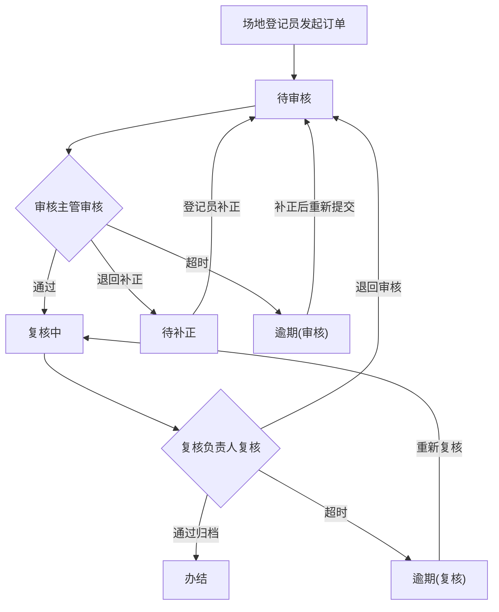

## 1. 产品概述
体育场馆月底集中处理场地订单系统，面向场馆前台登记员、运营主管审核和场馆经理复核归档的三级接力流程。解决场地订单口头流转无凭据、状态不透明、逾期无人盯等问题，实现从登记到归档全链路可追溯、可审计。

## 2. 核心功能

### 2.1 用户角色
| 角色 | 角色代码 | 注册方式 | 核心权限 |
|------|----------|----------|----------|
| 场地登记员 | registrar | 系统预设 | 发起场地订单、补正材料、查看待补正列表 |
| 场地审核主管 | reviewer | 系统预设 | 审核办理场地订单、退回补正、标记异常 |
| 体育场馆复核负责人 | approver | 系统预设 | 复核归档、最终确认、查看到期预警 |

### 2.2 功能模块
1. **场地订单登记模块**：新增场地预约订单、提交补正材料、查看待补正列表
2. **过程核验模块**：审核主管办理订单、退回补正、标记异常原因、批量审核
3. **复核归档模块**：复核负责人复核确认、归档办结、到期预警看板、批量推进

### 2.3 页面详情
| 页面名称 | 模块名称 | 功能描述 |
|----------|----------|----------|
| 登录/角色切换 | 角色管理 | 选择当前身份（登记员/主管/负责人），切换后列表和操作跟随角色 |
| 订单列表 | 场地订单登记 | 按角色显示待处理/全部订单，支持状态筛选（待补正/审核中/复核中/办结/逾期），到期预警分类（正常/临期/逾期） |
| 订单详情 | 过程核验 | 查看订单完整信息、处理记录、附件证据；办理/退回/复核操作；显示异常原因和补正动作 |
| 新增订单 | 场地订单登记 | 填写场地预约信息、上传附件、选择预约时段和场地 |
| 批量处理 | 过程核验/复核归档 | 勾选多条订单批量审核/复核，逐条返回成功/失败原因 |
| 到期预警看板 | 复核归档 | 按正常/临期/逾期三队展示，节点超时关联责任人 |
| 审计日志 | 复核归档 | 全量操作记录，按订单号/操作人/时间筛选 |

## 3. 核心流程

### 3.1 订单状态流转
场地登记员发起订单 → 状态「待审核」→ 场地审核主管审核 → 状态「审核中」→ 审核通过 → 状态「复核中」→ 体育场馆复核负责人复核 → 状态「办结」
- 审核不通过/缺材料 → 退回补正 → 状态「待补正」→ 登记员补正 → 状态「待审核」
- 复核不通过 → 退回审核 → 状态「审核中」
- 超时未处理 → 状态标记逾期

### 3.2 到期预警流程
- 正常：距离截止日期 > 3天
- 临期：距离截止日期 ≤ 3天
- 逾期：已超过截止日期，标记责任人和超时节点

## 4. 用户界面设计

### 4.1 设计风格
- 主色调：深蓝 #1e3a5f（体育场馆专业感），辅色：橙色 #f59e0b（预警强调）
- 按钮风格：圆角8px，主要操作用实心按钮，次要操作用描边按钮
- 字体：思源黑体/Noto Sans SC，标题18px/16px，正文14px，辅助文字12px
- 布局：左侧导航栏 + 右侧内容区，顶部角色切换栏
- 图标：Lucide React 图标库

### 4.2 页面设计概览
| 页面名称 | 模块名称 | UI元素 |
|----------|----------|--------|
| 登录/角色切换 | 角色选择 | 三张角色卡片，点击切换，顶部显示当前角色和权限说明 |
| 订单列表 | 筛选区 | 状态Tab切换 + 到期预警三色标签(绿/黄/红) + 搜索框 + 批量勾选 |
| 订单详情 | 信息区 | 订单基础信息卡 + 流转时间线 + 附件列表 + 操作按钮 + 异常原因标签 |
| 新增订单 | 表单区 | 场地选择 + 时段选择 + 预约信息 + 附件上传 + 提交按钮 |
| 批量处理 | 结果区 | 勾选列表 + 批量操作栏 + 逐条结果(成功✓/失败✗+原因) |
| 到期预警看板 | 看板区 | 三列看板(正常/临期/逾期)，卡片显示订单号、场地、责任人、剩余天数 |
| 审计日志 | 时间线 | 按时间倒序的操作记录，每条含操作人、操作、时间、备注 |

### 4.3 响应式
- 桌面优先设计，最小宽度1200px
- 列表页支持固定表头滚动
- 详情页左右分栏（信息+操作）

## 5. 业务规则

### 5.1 接口校验规则
- 当前角色校验：非对应角色不能执行该角色操作
- 当前处理人校验：只能处理分配给自己的订单
- 状态校验：只能执行当前状态允许的流转
- 版本校验：提交时版本号必须与当前一致，防止并发冲突
- 必填证据校验：办理/复核必须上传附件或填写意见
- 越权拦截：角色不匹配直接拒绝
- 重复提交拦截：同一操作不可重复执行
- 状态冲突拦截：状态不允许的操作直接拒绝

### 5.2 批量处理规则
- 批量处理前逐条检查：补正原因、退回意见、上一处理人结果
- 逾期或缺资料订单继续留在待处理列表，不参与批量推进
- 批量结果逐条返回成功/失败原因

### 5.3 到期预警规则
- 正常：截止日期 - 当前日期 > 3天
- 临期：0 < 截止日期 - 当前日期 ≤ 3天
- 逾期：截止日期 < 当前日期
- 节点超时计算到具体责任人
