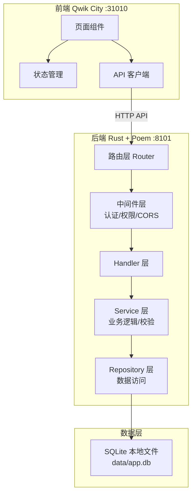
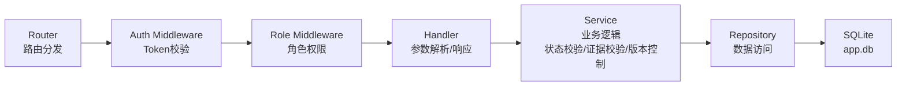
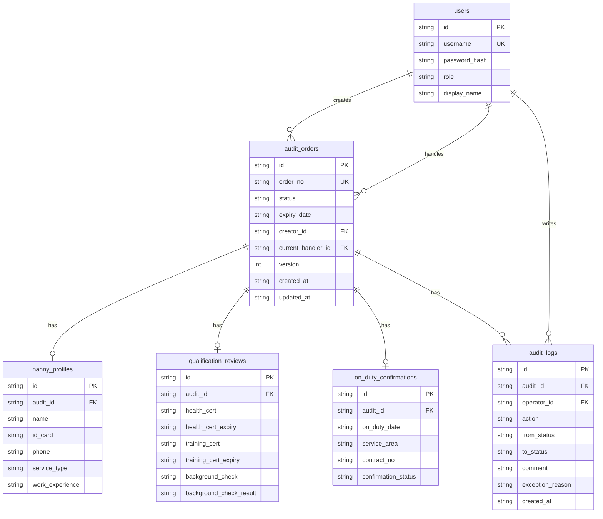

## 1. 架构设计



## 2. 技术说明

- 前端：Qwik City + TypeScript + Tailwind CSS
- 前端端口：31010
- 后端：Rust + Poem Web Framework + rusqlite
- 后端端口：8101
- 数据库：SQLite（项目内本地文件 `backend/data/app.db`）
- CORS：允许 `http://localhost:31010`

## 3. 路由定义

### 3.1 前端路由

| 路由 | 用途 |
|------|------|
| / | 审核单列表页（默认） |
| /login | 登录页 |
| /audit/:id | 审核单详情页 |
| /batch | 批量处理页 |
| /expiry | 到期预警看板 |

### 3.2 后端 API 路由

| 路由 | 方法 | 用途 |
|------|------|------|
| /api/auth/login | POST | 登录获取Token |
| /api/audits | GET | 获取审核单列表（支持筛选） |
| /api/audits | POST | 创建审核单 |
| /api/audits/:id | GET | 获取审核单详情 |
| /api/audits/:id/process | POST | 处理审核单（推进/退回/复核/办结） |
| /api/audits/:id/withdraw | POST | 撤回审核单 |
| /api/audits/batch | POST | 批量处理审核单 |
| /api/audits/expiry | GET | 到期预警列表 |
| /api/dashboard/stats | GET | 统计数据 |

## 4. API 定义

### 4.1 认证

```typescript
interface LoginRequest {
  username: string;
  password: string;
}

interface LoginResponse {
  token: string;
  role: "dispatcher" | "supervisor" | "manager";
  username: string;
}
```

### 4.2 审核单

```typescript
interface AuditOrder {
  id: string;
  order_no: string;
  status: "pending" | "processing" | "reviewing" | "correction_needed" | "completed" | "withdrawn";
  expiry_date: string;
  creator_id: string;
  creator_name: string;
  current_handler_id: string | null;
  current_handler_name: string | null;
  version: number;
  nanny_profile: NannyProfile | null;
  qualification_review: QualificationReview | null;
  on_duty_confirmation: OnDutyConfirmation | null;
  created_at: string;
  updated_at: string;
}

interface NannyProfile {
  name: string;
  id_card: string;
  phone: string;
  service_type: string;
  work_experience: string;
}

interface QualificationReview {
  health_cert: string;
  health_cert_expiry: string;
  training_cert: string;
  training_cert_expiry: string;
  background_check: string;
  background_check_result: string;
}

interface OnDutyConfirmation {
  on_duty_date: string;
  service_area: string;
  contract_no: string;
  confirmation_status: string;
}

interface ProcessRequest {
  action: "advance" | "return_correction" | "review_pass" | "review_reject" | "complete";
  comment: string;
  exception_reason: string | null;
  nanny_profile: NannyProfile | null;
  qualification_review: QualificationReview | null;
  on_duty_confirmation: OnDutyConfirmation | null;
  version: number;
}

interface ProcessResponse {
  success: boolean;
  error_code: string | null;
  error_message: string | null;
  audit_order: AuditOrder | null;
}

interface BatchProcessRequest {
  action: "advance" | "return_correction" | "review_pass" | "complete";
  audit_ids: string[];
  comment: string;
  exception_reason: string | null;
}

interface BatchProcessResponse {
  total: number;
  success_count: number;
  fail_count: number;
  results: BatchProcessItemResult[];
}

interface BatchProcessItemResult {
  audit_id: string;
  order_no: string;
  success: boolean;
  error_code: string | null;
  error_message: string | null;
}

interface AuditListQuery {
  status?: string;
  expiry_status?: "normal" | "expiring_soon" | "overdue";
  role_queue?: "dispatcher" | "supervisor" | "manager";
  page?: number;
  page_size?: number;
}

interface AuditListResponse {
  total: number;
  items: AuditOrder[];
  page: number;
  page_size: number;
}
```

### 4.3 审计备注

```typescript
interface AuditLog {
  id: string;
  audit_id: string;
  operator_id: string;
  operator_name: string;
  operator_role: string;
  action: string;
  from_status: string | null;
  to_status: string;
  comment: string;
  exception_reason: string | null;
  created_at: string;
}
```

### 4.4 统计

```typescript
interface DashboardStats {
  pending_count: number;
  processing_count: number;
  reviewing_count: number;
  correction_needed_count: number;
  completed_count: number;
  overdue_count: number;
  expiring_soon_count: number;
}
```

### 4.5 错误码

| 错误码 | 含义 |
|--------|------|
| ERR_ROLE_MISMATCH | 当前角色无权执行此操作 |
| ERR_HANDLER_MISMATCH | 当前处理人与单据处理人不匹配 |
| ERR_STATUS_CONFLICT | 单据状态不允许此操作（状态冲突） |
| ERR_VERSION_CONFLICT | 版本冲突，数据已被他人修改 |
| ERR_MISSING_EVIDENCE | 缺少必填证据（阿姨档案/资质审核/上岗确认） |
| ERR_DUPLICATE_SUBMIT | 重复提交 |
| ERR_NOT_FOUND | 审核单不存在 |

## 5. 服务端架构图



## 6. 数据模型

### 6.1 数据模型定义



### 6.2 数据定义语言

```sql
CREATE TABLE IF NOT EXISTS users (
    id TEXT PRIMARY KEY,
    username TEXT NOT NULL UNIQUE,
    password_hash TEXT NOT NULL,
    role TEXT NOT NULL CHECK(role IN ('dispatcher', 'supervisor', 'manager')),
    display_name TEXT NOT NULL
);

CREATE TABLE IF NOT EXISTS audit_orders (
    id TEXT PRIMARY KEY,
    order_no TEXT NOT NULL UNIQUE,
    status TEXT NOT NULL CHECK(status IN ('pending', 'processing', 'reviewing', 'correction_needed', 'completed', 'withdrawn')),
    expiry_date TEXT NOT NULL,
    creator_id TEXT NOT NULL REFERENCES users(id),
    current_handler_id TEXT REFERENCES users(id),
    version INTEGER NOT NULL DEFAULT 1,
    created_at TEXT NOT NULL,
    updated_at TEXT NOT NULL
);

CREATE TABLE IF NOT EXISTS nanny_profiles (
    id TEXT PRIMARY KEY,
    audit_id TEXT NOT NULL UNIQUE REFERENCES audit_orders(id),
    name TEXT,
    id_card TEXT,
    phone TEXT,
    service_type TEXT,
    work_experience TEXT
);

CREATE TABLE IF NOT EXISTS qualification_reviews (
    id TEXT PRIMARY KEY,
    audit_id TEXT NOT NULL UNIQUE REFERENCES audit_orders(id),
    health_cert TEXT,
    health_cert_expiry TEXT,
    training_cert TEXT,
    training_cert_expiry TEXT,
    background_check TEXT,
    background_check_result TEXT
);

CREATE TABLE IF NOT EXISTS on_duty_confirmations (
    id TEXT PRIMARY KEY,
    audit_id TEXT NOT NULL UNIQUE REFERENCES audit_orders(id),
    on_duty_date TEXT,
    service_area TEXT,
    contract_no TEXT,
    confirmation_status TEXT
);

CREATE TABLE IF NOT EXISTS audit_logs (
    id TEXT PRIMARY KEY,
    audit_id TEXT NOT NULL REFERENCES audit_orders(id),
    operator_id TEXT NOT NULL REFERENCES users(id),
    action TEXT NOT NULL,
    from_status TEXT,
    to_status TEXT NOT NULL,
    comment TEXT,
    exception_reason TEXT,
    created_at TEXT NOT NULL
);

CREATE INDEX IF NOT EXISTS idx_audit_orders_status ON audit_orders(status);
CREATE INDEX IF NOT EXISTS idx_audit_orders_creator ON audit_orders(creator_id);
CREATE INDEX IF NOT EXISTS idx_audit_orders_handler ON audit_orders(current_handler_id);
CREATE INDEX IF NOT EXISTS idx_audit_orders_expiry ON audit_orders(expiry_date);
CREATE INDEX IF NOT EXISTS idx_audit_logs_audit ON audit_logs(audit_id);

-- 初始用户数据
INSERT OR IGNORE INTO users (id, username, password_hash, role, display_name) VALUES
    ('u1', 'dispatcher', 'demo123', 'dispatcher', '派单客服-张敏'),
    ('u2', 'supervisor', 'demo123', 'supervisor', '服务督导-李芳'),
    ('u3', 'manager', 'demo123', 'manager', '城市经理-王强');

-- 演示单据1: 正常流转单
INSERT OR IGNORE INTO audit_orders (id, order_no, status, expiry_date, creator_id, current_handler_id, version, created_at, updated_at) VALUES
    ('a1', 'AUD-2026-001', 'pending', '2026-07-15', 'u1', NULL, 1, '2026-06-10T09:00:00Z', '2026-06-10T09:00:00Z');
INSERT OR IGNORE INTO nanny_profiles (id, audit_id, name, id_card, phone, service_type, work_experience) VALUES
    ('np1', 'a1', '陈阿姨', '310101199001011234', '13800001111', '月嫂', '5年月嫂经验');
INSERT OR IGNORE INTO qualification_reviews (id, audit_id, health_cert, health_cert_expiry, training_cert, training_cert_expiry, background_check, background_check_result) VALUES
    ('qr1', 'a1', 'HC-2026-001', '2027-01-01', 'TC-2026-001', '2027-06-01', 'BC-2026-001', '通过');
INSERT OR IGNORE INTO on_duty_confirmations (id, audit_id, on_duty_date, service_area, contract_no, confirmation_status) VALUES
    ('od1', 'a1', '2026-07-01', '浦东新区', 'CT-2026-001', '待确认');

-- 演示单据2: 缺材料单
INSERT OR IGNORE INTO audit_orders (id, order_no, status, expiry_date, creator_id, current_handler_id, version, created_at, updated_at) VALUES
    ('a2', 'AUD-2026-002', 'pending', '2026-07-10', 'u1', NULL, 1, '2026-06-08T10:00:00Z', '2026-06-08T10:00:00Z');
INSERT OR IGNORE INTO nanny_profiles (id, audit_id, name, id_card, phone, service_type, work_experience) VALUES
    ('np2', 'a2', '周阿姨', '', '13800002222', '育儿嫂', '3年育儿嫂经验');
INSERT OR IGNORE INTO qualification_reviews (id, audit_id, health_cert, health_cert_expiry, training_cert, training_cert_expiry, background_check, background_check_result) VALUES
    ('qr2', 'a2', '', '', '', '', '', '');
INSERT OR IGNORE INTO on_duty_confirmations (id, audit_id, on_duty_date, service_area, contract_no, confirmation_status) VALUES
    ('od2', 'a2', '', '', '', '');

-- 演示单据3: 超时/逾期单
INSERT OR IGNORE INTO audit_orders (id, order_no, status, expiry_date, creator_id, current_handler_id, version, created_at, updated_at) VALUES
    ('a3', 'AUD-2026-003', 'processing', '2026-06-05', 'u1', 'u2', 2, '2026-05-20T08:00:00Z', '2026-06-01T14:00:00Z');
INSERT OR IGNORE INTO nanny_profiles (id, audit_id, name, id_card, phone, service_type, work_experience) VALUES
    ('np3', 'a3', '吴阿姨', '310101198505052345', '13800003333', '保洁', '8年保洁经验');
INSERT OR IGNORE INTO qualification_reviews (id, audit_id, health_cert, health_cert_expiry, training_cert, training_cert_expiry, background_check, background_check_result) VALUES
    ('qr3', 'a3', 'HC-2026-003', '2026-12-01', 'TC-2026-003', '2027-05-01', 'BC-2026-003', '通过');
INSERT OR IGNORE INTO on_duty_confirmations (id, audit_id, on_duty_date, service_area, contract_no, confirmation_status) VALUES
    ('od3', 'a3', '2026-06-15', '徐汇区', 'CT-2026-003', '待确认');
INSERT OR IGNORE INTO audit_logs (id, audit_id, operator_id, action, from_status, to_status, comment, exception_reason, created_at) VALUES
    ('al3', 'a3', 'u2', 'advance', 'pending', 'processing', '已领取，开始审核', NULL, '2026-06-01T14:00:00Z');

-- 演示单据4: 退回补正单
INSERT OR IGNORE INTO audit_orders (id, order_no, status, expiry_date, creator_id, current_handler_id, version, created_at, updated_at) VALUES
    ('a4', 'AUD-2026-004', 'correction_needed', '2026-07-20', 'u1', 'u2', 3, '2026-06-01T11:00:00Z', '2026-06-10T16:00:00Z');
INSERT OR IGNORE INTO nanny_profiles (id, audit_id, name, id_card, phone, service_type, work_experience) VALUES
    ('np4', 'a4', '赵阿姨', '310101199203033456', '13800004444', '护工', '6年护工经验');
INSERT OR IGNORE INTO qualification_reviews (id, audit_id, health_cert, health_cert_expiry, training_cert, training_cert_expiry, background_check, background_check_result) VALUES
    ('qr4', 'a4', 'HC-2026-004', '2027-03-01', '', '', '', '');
INSERT OR IGNORE INTO on_duty_confirmations (id, audit_id, on_duty_date, service_area, contract_no, confirmation_status) VALUES
    ('od4', 'a4', '', '', '', '');
INSERT OR IGNORE INTO audit_logs (id, audit_id, operator_id, action, from_status, to_status, comment, exception_reason, created_at) VALUES
    ('al4a', 'a4', 'u2', 'advance', 'pending', 'processing', '已领取审核', NULL, '2026-06-02T09:00:00Z'),
    ('al4b', 'a4', 'u3', 'return_correction', 'reviewing', 'correction_needed', '培训证缺失，需补正', '培训证缺失', '2026-06-10T16:00:00Z');
```
