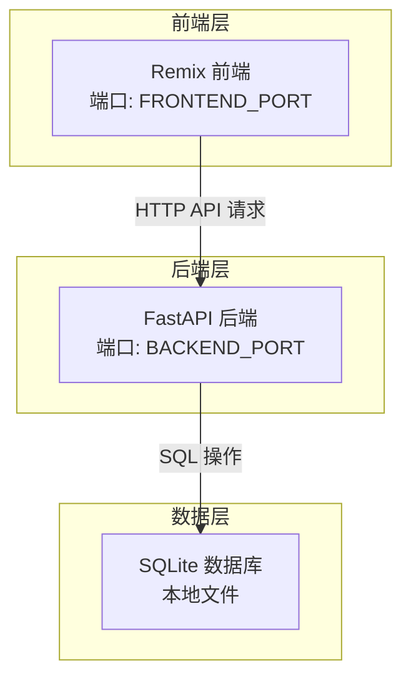
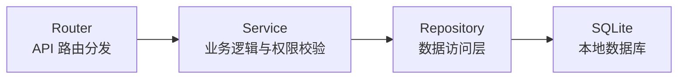
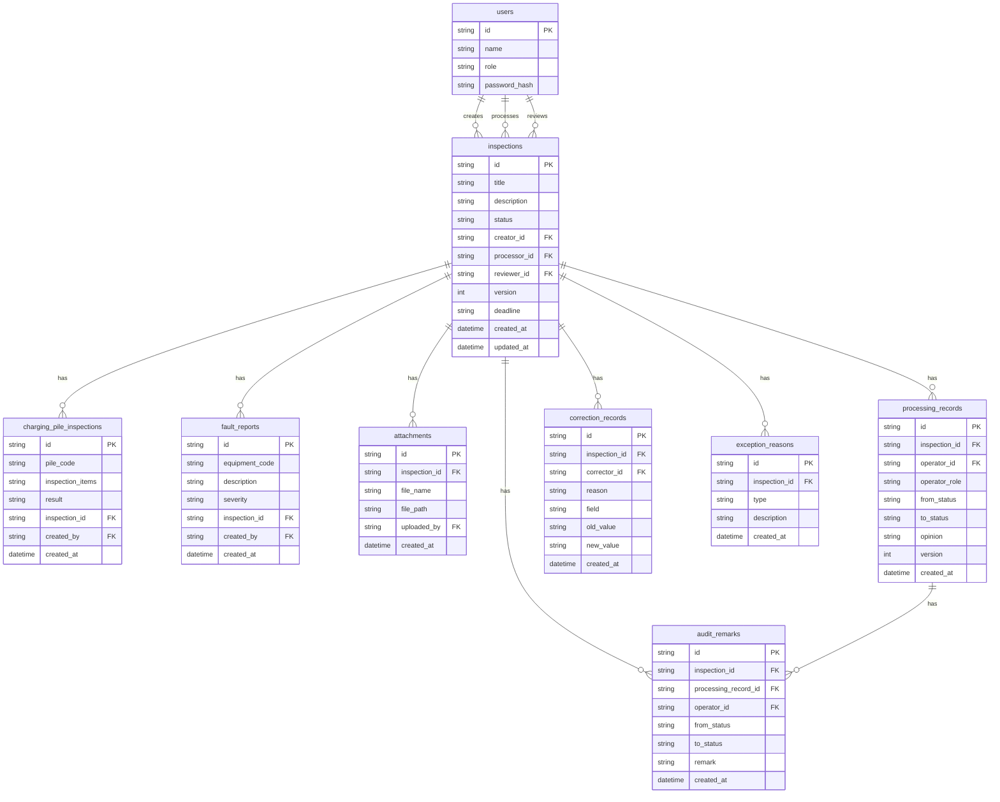

## 1. 架构设计



## 2. 技术说明

- 前端：Remix + React 18 + TypeScript + Tailwind CSS
- 后端：Python 3.11+ + FastAPI + SQLAlchemy + Pydantic
- 数据库：SQLite（本地文件存储，无需额外服务）
- 端口：前端 `FRONTEND_PORT`，后端 `BACKEND_PORT`，通过 .env 文件配置

## 3. 路由定义

| 路由 | 用途 |
|------|------|
| `/` | 首页/设备巡检单列表 |
| `/inspection/:id` | 设备巡检单详情 |
| `/inspection/new` | 创建设备巡检单 |
| `/batch-result` | 批量处理结果 |
| `/audit-trail` | 审计轨迹 |
| `/expiry-queue` | 到期预警队列 |
| `/charging-pile-inspection` | 充电桩巡检列表 |
| `/charging-pile-inspection/new` | 新建充电桩巡检 |
| `/fault-report` | 故障上报列表 |
| `/fault-report/new` | 新建故障上报 |
| `/login` | 登录/角色选择 |

## 4. API 定义

### 4.1 认证

```
POST /api/auth/login     → { user_id, role, token }
GET  /api/auth/me        → { user_id, role, name }
```

### 4.2 设备巡检单

```
GET    /api/inspections                    → InspectionListItem[]
GET    /api/inspections/:id                → InspectionDetail
POST   /api/inspections                    → InspectionDetail（创建）
PUT    /api/inspections/:id/submit         → InspectionDetail（提交）
PUT    /api/inspections/:id/process        → InspectionDetail（处理）
PUT    /api/inspections/:id/review         → InspectionDetail（复核）
PUT    /api/inspections/:id/return         → InspectionDetail（退回）
PUT    /api/inspections/:id/correct        → InspectionDetail（补正）
POST   /api/inspections/batch-process      → BatchResult[]
POST   /api/inspections/batch-advance      → BatchResult[]
GET    /api/inspections/:id/audit-trail    → AuditRecord[]
GET    /api/inspections/stats              → { total, by_status, by_expiry }
```

### 4.3 充电桩巡检

```
GET    /api/charging-pile-inspections      → ChargingPileInspection[]
POST   /api/charging-pile-inspections      → ChargingPileInspection
GET    /api/charging-pile-inspections/:id  → ChargingPileInspectionDetail
```

### 4.4 故障上报

```
GET    /api/fault-reports                  → FaultReport[]
POST   /api/fault-reports                  → FaultReport
GET    /api/fault-reports/:id              → FaultReportDetail
```

### 4.5 到期预警

```
GET    /api/expiry-queue                   → { normal[], approaching[], overdue[] }
```

### 4.6 TypeScript 类型定义

```typescript
interface Inspection {
  id: string
  title: string
  description: string
  status: "pending_submit" | "pending_process" | "pending_review" | "completed" | "returned" | "resubmitted"
  creator_id: string
  creator_name: string
  processor_id?: string
  processor_name?: string
  reviewer_id?: string
  reviewer_name?: string
  version: number
  charging_pile_inspection_ids: string[]
  fault_report_ids: string[]
  created_at: string
  updated_at: string
  deadline: string
  expiry_status: "normal" | "approaching" | "overdue"
}

interface InspectionDetail extends Inspection {
  processor_opinion?: string
  processor_attachments?: Attachment[]
  reviewer_opinion?: string
  reviewer_attachments?: Attachment[]
  previous_opinion?: PreviousOpinion
  correction_records?: CorrectionRecord[]
  exception_reasons?: ExceptionReason[]
  audit_trail: AuditRecord[]
}

interface BatchResult {
  inspection_id: string
  success: boolean
  reason?: string
}

interface AuditRecord {
  id: string
  inspection_id: string
  from_status: string
  to_status: string
  operator_id: string
  operator_name: string
  operator_role: string
  opinion?: string
  remark?: string
  created_at: string
}

interface CorrectionRecord {
  id: string
  inspection_id: string
  corrector_id: string
  corrector_name: string
  reason: string
  field: string
  old_value?: string
  new_value?: string
  created_at: string
}

interface ExceptionReason {
  id: string
  inspection_id: string
  type: "material" | "permission" | "deadline" | "status"
  description: string
  created_at: string
}

interface Attachment {
  id: string
  file_name: string
  file_path: string
  uploaded_by: string
  created_at: string
}

interface PreviousOpinion {
  operator_name: string
  operator_role: string
  opinion: string
  attachments: Attachment[]
  created_at: string
}
```

## 5. 服务器架构图



## 6. 数据模型

### 6.1 数据模型 ER 图



### 6.2 数据定义语言

```sql
CREATE TABLE users (
    id TEXT PRIMARY KEY,
    name TEXT NOT NULL,
    role TEXT NOT NULL CHECK(role IN ('duty_officer', 'maintenance_engineer', 'operations_manager')),
    password_hash TEXT NOT NULL
);

CREATE TABLE inspections (
    id TEXT PRIMARY KEY,
    title TEXT NOT NULL,
    description TEXT,
    status TEXT NOT NULL DEFAULT 'pending_submit' CHECK(status IN ('pending_submit', 'pending_process', 'pending_review', 'completed', 'returned', 'resubmitted')),
    creator_id TEXT NOT NULL REFERENCES users(id),
    processor_id TEXT REFERENCES users(id),
    reviewer_id TEXT REFERENCES users(id),
    version INTEGER NOT NULL DEFAULT 1,
    deadline TEXT NOT NULL,
    created_at TEXT NOT NULL DEFAULT (datetime('now')),
    updated_at TEXT NOT NULL DEFAULT (datetime('now'))
);

CREATE TABLE charging_pile_inspections (
    id TEXT PRIMARY KEY,
    pile_code TEXT NOT NULL,
    inspection_items TEXT NOT NULL,
    result TEXT,
    inspection_id TEXT REFERENCES inspections(id) ON DELETE SET NULL,
    created_by TEXT NOT NULL REFERENCES users(id),
    created_at TEXT NOT NULL DEFAULT (datetime('now'))
);

CREATE TABLE fault_reports (
    id TEXT PRIMARY KEY,
    equipment_code TEXT NOT NULL,
    description TEXT NOT NULL,
    severity TEXT NOT NULL CHECK(severity IN ('low', 'medium', 'high', 'critical')),
    inspection_id TEXT REFERENCES inspections(id) ON DELETE SET NULL,
    created_by TEXT NOT NULL REFERENCES users(id),
    created_at TEXT NOT NULL DEFAULT (datetime('now'))
);

CREATE TABLE attachments (
    id TEXT PRIMARY KEY,
    inspection_id TEXT NOT NULL REFERENCES inspections(id) ON DELETE CASCADE,
    file_name TEXT NOT NULL,
    file_path TEXT NOT NULL,
    uploaded_by TEXT NOT NULL REFERENCES users(id),
    created_at TEXT NOT NULL DEFAULT (datetime('now'))
);

CREATE TABLE processing_records (
    id TEXT PRIMARY KEY,
    inspection_id TEXT NOT NULL REFERENCES inspections(id) ON DELETE CASCADE,
    operator_id TEXT NOT NULL REFERENCES users(id),
    operator_role TEXT NOT NULL,
    from_status TEXT NOT NULL,
    to_status TEXT NOT NULL,
    opinion TEXT,
    version INTEGER NOT NULL,
    created_at TEXT NOT NULL DEFAULT (datetime('now'))
);

CREATE TABLE audit_remarks (
    id TEXT PRIMARY KEY,
    inspection_id TEXT NOT NULL REFERENCES inspections(id) ON DELETE CASCADE,
    processing_record_id TEXT REFERENCES processing_records(id) ON DELETE SET NULL,
    operator_id TEXT NOT NULL REFERENCES users(id),
    from_status TEXT NOT NULL,
    to_status TEXT NOT NULL,
    remark TEXT,
    created_at TEXT NOT NULL DEFAULT (datetime('now'))
);

CREATE TABLE correction_records (
    id TEXT PRIMARY KEY,
    inspection_id TEXT NOT NULL REFERENCES inspections(id) ON DELETE CASCADE,
    corrector_id TEXT NOT NULL REFERENCES users(id),
    reason TEXT NOT NULL,
    field TEXT NOT NULL,
    old_value TEXT,
    new_value TEXT,
    created_at TEXT NOT NULL DEFAULT (datetime('now'))
);

CREATE TABLE exception_reasons (
    id TEXT PRIMARY KEY,
    inspection_id TEXT NOT NULL REFERENCES inspections(id) ON DELETE CASCADE,
    type TEXT NOT NULL CHECK(type IN ('material', 'permission', 'deadline', 'status')),
    description TEXT NOT NULL,
    created_at TEXT NOT NULL DEFAULT (datetime('now'))
);

CREATE INDEX idx_inspections_status ON inspections(status);
CREATE INDEX idx_inspections_creator ON inspections(creator_id);
CREATE INDEX idx_inspections_processor ON inspections(processor_id);
CREATE INDEX idx_inspections_deadline ON inspections(deadline);
CREATE INDEX idx_processing_records_inspection ON processing_records(inspection_id);
CREATE INDEX idx_audit_remarks_inspection ON audit_remarks(inspection_id);
CREATE INDEX idx_correction_records_inspection ON correction_records(inspection_id);
CREATE INDEX idx_exception_reasons_inspection ON exception_reasons(inspection_id);
CREATE INDEX idx_attachments_inspection ON attachments(inspection_id);
```
