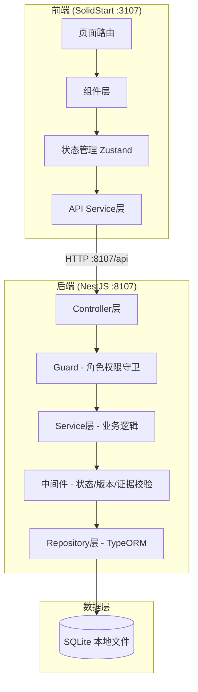
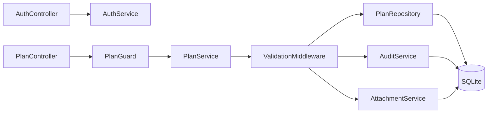
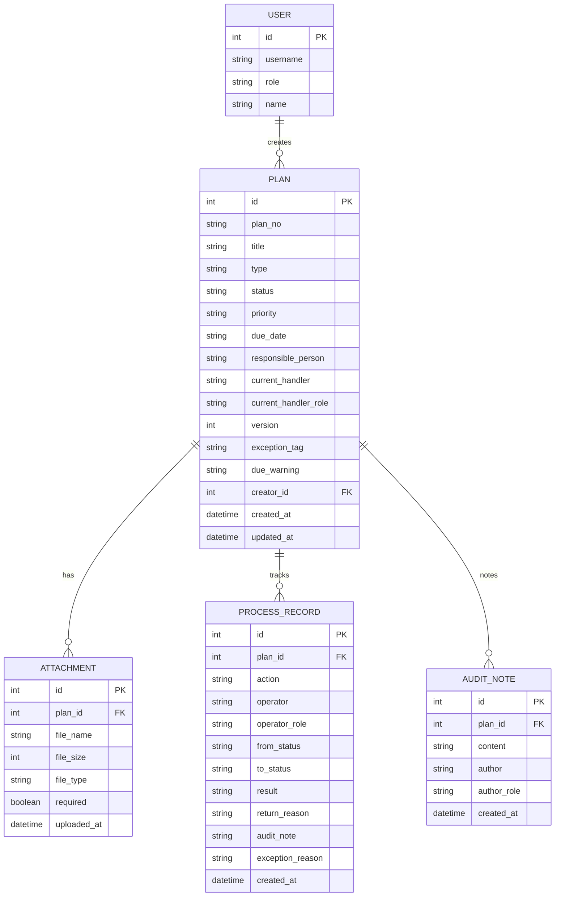

## 1. 架构设计



## 2. 技术说明

- 前端：SolidStart + SolidJS + TailwindCSS + Zustand
- 后端：NestJS + TypeORM + better-sqlite3
- 数据库：SQLite（本地文件 pr_system.db）
- 端口：前端 3107，后端 8107
- CORS：后端白名单 http://localhost:3107

## 3. 路由定义

### 前端路由

| 路由 | 用途 |
|------|------|
| /login | 登录页，演示账号选择 |
| / | 列表页（传播计划/素材审核/投放确认Tab） |
| /plan/:id | 传播计划单详情页 |
| /batch-result | 批量处理结果页 |

### 后端路由

| 路由 | 方法 | 用途 |
|------|------|------|
| /api/auth/login | POST | 登录 |
| /api/auth/switch-role | POST | 角色切换 |
| /api/plans | GET | 传播计划单列表（支持筛选） |
| /api/plans | POST | 发起传播计划单 |
| /api/plans/:id | GET | 传播计划单详情 |
| /api/plans/:id/sign | POST | 签收 |
| /api/plans/:id/review | POST | 审核/办理 |
| /api/plans/:id/return | POST | 退回补正 |
| /api/plans/:id/correct | POST | 补正提交 |
| /api/plans/:id/verify | POST | 复核归档 |
| /api/plans/:id/reject | POST | 异常回传 |
| /api/plans/batch-sign | POST | 批量签收 |
| /api/plans/batch-verify | POST | 批量复核 |
| /api/plans/:id/audit-trail | GET | 审计轨迹 |
| /api/plans/:id/attachments | GET/POST | 附件管理 |
| /api/stats | GET | 统计数据 |

## 4. API 定义

### 核心类型

```typescript
type PlanStatus = 'draft' | 'pending_sign' | 'reviewing' | 'pending_verify' | 'archived' | 'returned' | 'rejected'
type Priority = 'urgent' | 'high' | 'normal' | 'low'
type DueWarning = 'normal' | 'approaching' | 'overdue'
type PlanType = 'communication_plan' | 'material_review' | 'placement_confirm'
type Role = 'registrar' | 'reviewer' | 'director'

interface Plan {
  id: string
  planNo: string
  title: string
  type: PlanType
  status: PlanStatus
  priority: Priority
  dueDate: string
  responsiblePerson: string
  currentHandler: string
  currentHandlerRole: Role
  version: number
  exceptionTag: string | null
  dueWarning: DueWarning
  attachments: Attachment[]
  processRecords: ProcessRecord[]
  auditNotes: AuditNote[]
  createdAt: string
  updatedAt: string
}

interface Attachment {
  id: string
  planId: string
  fileName: string
  fileSize: number
  fileType: string
  required: boolean
  uploadedAt: string | null
}

interface ProcessRecord {
  id: string
  planId: string
  action: string
  operator: string
  operatorRole: Role
  fromStatus: PlanStatus | null
  toStatus: PlanStatus
  result: string | null
  returnReason: string | null
  auditNote: string | null
  exceptionReason: string | null
  createdAt: string
}

interface AuditNote {
  id: string
  planId: string
  content: string
  author: string
  authorRole: Role
  createdAt: string
}

interface BatchResult {
  planId: string
  planNo: string
  success: boolean
  reason: string | null
}

interface ApiResponse<T> {
  code: number
  message: string
  data: T
}
```

### 请求/响应示例

**POST /api/plans/:id/verify** 复核归档请求：
```typescript
interface VerifyRequest {
  result: 'approve' | 'reject'
  auditNote?: string
  rejectReason?: string
  version: number // 乐观锁
}
```

**POST /api/plans/batch-verify** 批量复核响应：
```typescript
interface BatchVerifyResponse {
  results: BatchResult[]
}
```

## 5. 服务架构图



## 6. 数据模型

### 6.1 ER图



### 6.2 DDL语句

```sql
CREATE TABLE user (
  id INTEGER PRIMARY KEY AUTOINCREMENT,
  username TEXT NOT NULL UNIQUE,
  role TEXT NOT NULL CHECK(role IN ('registrar', 'reviewer', 'director')),
  name TEXT NOT NULL
);

CREATE TABLE plan (
  id INTEGER PRIMARY KEY AUTOINCREMENT,
  plan_no TEXT NOT NULL UNIQUE,
  title TEXT NOT NULL,
  type TEXT NOT NULL CHECK(type IN ('communication_plan', 'material_review', 'placement_confirm')),
  status TEXT NOT NULL CHECK(status IN ('draft', 'pending_sign', 'reviewing', 'pending_verify', 'archived', 'returned', 'rejected')),
  priority TEXT NOT NULL CHECK(priority IN ('urgent', 'high', 'normal', 'low')),
  due_date TEXT NOT NULL,
  responsible_person TEXT NOT NULL,
  current_handler TEXT NOT NULL,
  current_handler_role TEXT NOT NULL,
  version INTEGER NOT NULL DEFAULT 1,
  exception_tag TEXT,
  due_warning TEXT NOT NULL CHECK(due_warning IN ('normal', 'approaching', 'overdue')),
  creator_id INTEGER NOT NULL,
  created_at TEXT NOT NULL DEFAULT (datetime('now')),
  updated_at TEXT NOT NULL DEFAULT (datetime('now')),
  FOREIGN KEY (creator_id) REFERENCES user(id)
);

CREATE TABLE attachment (
  id INTEGER PRIMARY KEY AUTOINCREMENT,
  plan_id INTEGER NOT NULL,
  file_name TEXT NOT NULL,
  file_size INTEGER NOT NULL DEFAULT 0,
  file_type TEXT NOT NULL,
  required INTEGER NOT NULL DEFAULT 0,
  uploaded_at TEXT,
  FOREIGN KEY (plan_id) REFERENCES plan(id) ON DELETE CASCADE
);

CREATE TABLE process_record (
  id INTEGER PRIMARY KEY AUTOINCREMENT,
  plan_id INTEGER NOT NULL,
  action TEXT NOT NULL,
  operator TEXT NOT NULL,
  operator_role TEXT NOT NULL,
  from_status TEXT,
  to_status TEXT NOT NULL,
  result TEXT,
  return_reason TEXT,
  audit_note TEXT,
  exception_reason TEXT,
  created_at TEXT NOT NULL DEFAULT (datetime('now')),
  FOREIGN KEY (plan_id) REFERENCES plan(id) ON DELETE CASCADE
);

CREATE TABLE audit_note (
  id INTEGER PRIMARY KEY AUTOINCREMENT,
  plan_id INTEGER NOT NULL,
  content TEXT NOT NULL,
  author TEXT NOT NULL,
  author_role TEXT NOT NULL,
  created_at TEXT NOT NULL DEFAULT (datetime('now')),
  FOREIGN KEY (plan_id) REFERENCES plan(id) ON DELETE CASCADE
);

CREATE INDEX idx_plan_status ON plan(status);
CREATE INDEX idx_plan_type ON plan(type);
CREATE INDEX idx_plan_due_warning ON plan(due_warning);
CREATE INDEX idx_plan_creator ON plan(creator_id);
CREATE INDEX idx_process_record_plan ON process_record(plan_id);

INSERT INTO user (username, role, name) VALUES
  ('registrar', 'registrar', '张晓明'),
  ('reviewer', 'reviewer', '李审核'),
  ('director', 'director', '王总监');
```
