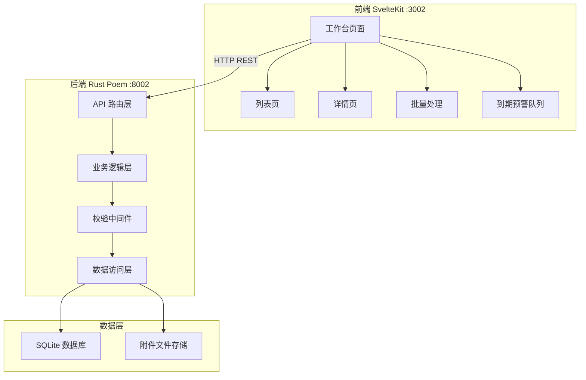
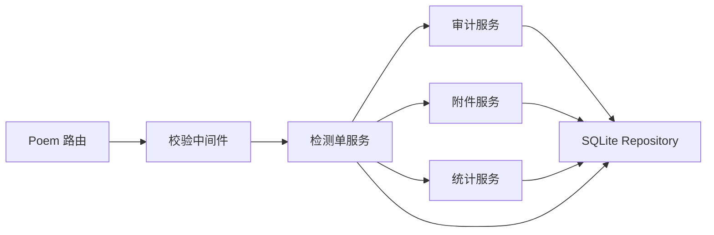
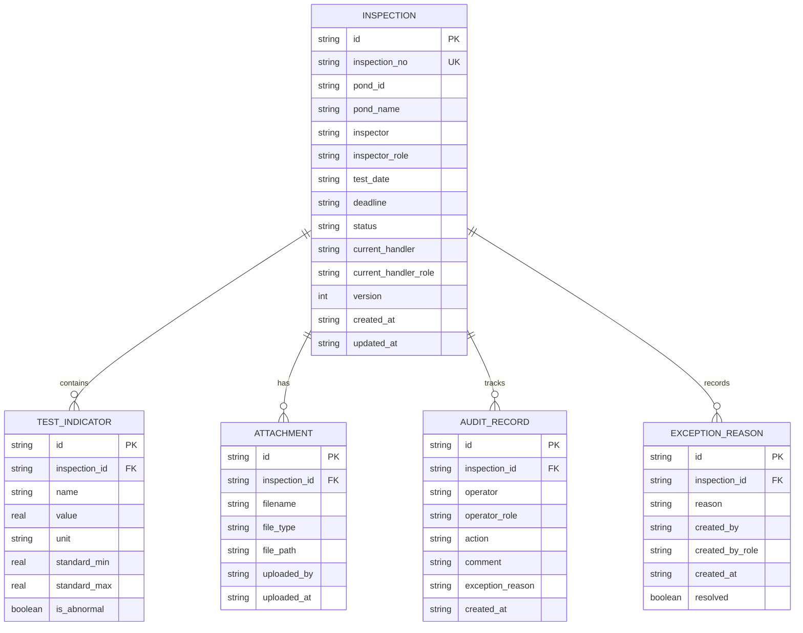

## 1. 架构设计



## 2. 技术说明

- **前端**：SvelteKit + TailwindCSS + Vite，端口 3002
- **初始化工具**：npm create svelte@latest
- **后端**：Rust + Poem 框架，端口 8002
- **数据库**：SQLite（项目内文件），含 seed 初始数据
- **CORS**：后端白名单允许 http://localhost:3002

## 3. 路由定义

| 路由 | 用途 |
|------|------|
| `/` | 工作台首页（统计卡片 + 到期预警队列） |
| `/inspections` | 水质检测单列表（筛选 + 批量操作） |
| `/inspections/[id]` | 水质检测单详情（流程 + 办理 + 审计轨迹） |

## 4. API 定义

### 4.1 通用响应结构

```typescript
interface ApiResponse<T> {
  code: number;
  message: string;
  data: T;
}

interface BatchResult {
  id: string;
  success: boolean;
  reason?: string;
}

interface Pagination {
  page: number;
  page_size: number;
  total: number;
}
```

### 4.2 水质检测单 API

| 方法 | 路径 | 说明 | 请求体 | 响应 |
|------|------|------|--------|------|
| GET | `/api/inspections` | 检测单列表（分页+筛选） | Query: status, pond_id, date_from, date_to, role, overdue_type, page, page_size | `ApiResponse<{ items: Inspection[], pagination: Pagination }>` |
| GET | `/api/inspections/:id` | 检测单详情 | - | `ApiResponse<InspectionDetail>` |
| POST | `/api/inspections` | 新建检测单 | `CreateInspectionRequest` | `ApiResponse<Inspection>` |
| PUT | `/api/inspections/:id/process` | 办理检测单（通过/退回/补正） | `ProcessRequest` | `ApiResponse<Inspection>` |
| POST | `/api/inspections/batch-process` | 批量办理 | `BatchProcessRequest` | `ApiResponse<BatchResult[]>` |
| GET | `/api/inspections/:id/audit-trail` | 审计轨迹 | - | `ApiResponse<AuditRecord[]>` |
| POST | `/api/inspections/:id/attachments` | 上传附件 | multipart/form-data | `ApiResponse<Attachment>` |
| GET | `/api/stats` | 统计数据 | Query: role | `ApiResponse<Stats>` |
| GET | `/api/overdue-queue` | 到期预警队列 | Query: role, overdue_type | `ApiResponse<Inspection[]>` |

### 4.3 核心类型定义

```typescript
type Role = "pond_admin" | "quality_engineer" | "base_director";
type Status = "pending_review" | "under_review" | "approved" | "pending_correction" | "synced";
type OverdueType = "normal" | "approaching" | "overdue";
type Action = "submit" | "approve" | "reject" | "correct" | "confirm_sync";

interface Inspection {
  id: string;
  inspection_no: string;
  pond_id: string;
  pond_name: string;
  inspector: string;
  inspector_role: Role;
  test_date: string;
  deadline: string;
  status: Status;
  current_handler: string;
  current_handler_role: Role;
  version: number;
  overdue_type: OverdueType;
  created_at: string;
  updated_at: string;
}

interface InspectionDetail extends Inspection {
  indicators: TestIndicator[];
  attachments: Attachment[];
  audit_trail: AuditRecord[];
  exception_reasons: ExceptionReason[];
  process_flow: ProcessNode[];
}

interface TestIndicator {
  name: string;
  value: number;
  unit: string;
  standard_min: number;
  standard_max: number;
  is_abnormal: boolean;
}

interface Attachment {
  id: string;
  inspection_id: string;
  filename: string;
  file_type: string;
  uploaded_by: string;
  uploaded_at: string;
}

interface AuditRecord {
  id: string;
  inspection_id: string;
  operator: string;
  operator_role: Role;
  action: Action;
  comment: string;
  exception_reason: string | null;
  created_at: string;
}

interface ExceptionReason {
  id: string;
  inspection_id: string;
  reason: string;
  created_by: string;
  created_by_role: Role;
  created_at: string;
  resolved: boolean;
}

interface ProcessNode {
  step: number;
  role: Role;
  label: string;
  handler: string;
  completed: boolean;
  completed_at: string | null;
  is_current: boolean;
}

interface CreateInspectionRequest {
  pond_id: string;
  inspector: string;
  test_date: string;
  deadline: string;
  indicators: { name: string; value: number; unit: string }[];
  attachment_ids: string[];
}

interface ProcessRequest {
  role: Role;
  operator: string;
  action: Action;
  comment: string;
  exception_reason?: string;
  version: number;
}

interface BatchProcessRequest {
  role: Role;
  operator: string;
  action: Action;
  comment: string;
  exception_reason?: string;
  items: { id: string; version: number }[];
}

interface Stats {
  pending_review: number;
  approved: number;
  synced: number;
  overdue: number;
  approaching: number;
}
```

## 5. 服务端架构图



## 6. 数据模型

### 6.1 数据模型定义



### 6.2 数据定义语言

```sql
CREATE TABLE IF NOT EXISTS inspection (
    id TEXT PRIMARY KEY,
    inspection_no TEXT UNIQUE NOT NULL,
    pond_id TEXT NOT NULL,
    pond_name TEXT NOT NULL,
    inspector TEXT NOT NULL,
    inspector_role TEXT NOT NULL DEFAULT 'pond_admin',
    test_date TEXT NOT NULL,
    deadline TEXT NOT NULL,
    status TEXT NOT NULL DEFAULT 'pending_review',
    current_handler TEXT NOT NULL,
    current_handler_role TEXT NOT NULL DEFAULT 'pond_admin',
    version INTEGER NOT NULL DEFAULT 1,
    created_at TEXT NOT NULL DEFAULT (datetime('now', 'localtime')),
    updated_at TEXT NOT NULL DEFAULT (datetime('now', 'localtime'))
);

CREATE TABLE IF NOT EXISTS test_indicator (
    id TEXT PRIMARY KEY,
    inspection_id TEXT NOT NULL REFERENCES inspection(id),
    name TEXT NOT NULL,
    value REAL NOT NULL,
    unit TEXT NOT NULL,
    standard_min REAL NOT NULL,
    standard_max REAL NOT NULL,
    is_abnormal BOOLEAN NOT NULL DEFAULT 0
);

CREATE TABLE IF NOT EXISTS attachment (
    id TEXT PRIMARY KEY,
    inspection_id TEXT NOT NULL REFERENCES inspection(id),
    filename TEXT NOT NULL,
    file_type TEXT NOT NULL,
    file_path TEXT NOT NULL,
    uploaded_by TEXT NOT NULL,
    uploaded_at TEXT NOT NULL DEFAULT (datetime('now', 'localtime'))
);

CREATE TABLE IF NOT EXISTS audit_record (
    id TEXT PRIMARY KEY,
    inspection_id TEXT NOT NULL REFERENCES inspection(id),
    operator TEXT NOT NULL,
    operator_role TEXT NOT NULL,
    action TEXT NOT NULL,
    comment TEXT NOT NULL DEFAULT '',
    exception_reason TEXT,
    created_at TEXT NOT NULL DEFAULT (datetime('now', 'localtime'))
);

CREATE TABLE IF NOT EXISTS exception_reason (
    id TEXT PRIMARY KEY,
    inspection_id TEXT NOT NULL REFERENCES inspection(id),
    reason TEXT NOT NULL,
    created_by TEXT NOT NULL,
    created_by_role TEXT NOT NULL,
    created_at TEXT NOT NULL DEFAULT (datetime('now', 'localtime')),
    resolved BOOLEAN NOT NULL DEFAULT 0
);

CREATE INDEX IF NOT EXISTS idx_inspection_status ON inspection(status);
CREATE INDEX IF NOT EXISTS idx_inspection_current_handler_role ON inspection(current_handler_role);
CREATE INDEX IF NOT EXISTS idx_inspection_deadline ON inspection(deadline);
CREATE INDEX IF NOT EXISTS idx_test_indicator_inspection ON test_indicator(inspection_id);
CREATE INDEX IF NOT EXISTS idx_attachment_inspection ON attachment(inspection_id);
CREATE INDEX IF NOT EXISTS idx_audit_record_inspection ON audit_record(inspection_id);
CREATE INDEX IF NOT EXISTS idx_exception_reason_inspection ON exception_reason(inspection_id);
```
