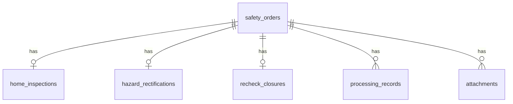

## 1. 架构设计

```mermaid
flowchart TB
    "SvelteKit前端:3004" -->|"API请求"| "Hono后端:8004"
    "Hono后端:8004" -->|"SQL查询"| "SQLite数据库"
    "Hono后端:8004" -->|"CORS"| "SvelteKit前端:3004"
```

## 2. 技术说明

- 前端：SvelteKit + TailwindCSS + lucide-svelte
- 后端：Node.js + Hono + better-sqlite3
- 数据库：SQLite（项目内文件，含seed脚本）
- 端口：前端3004，后端8004
- CORS：后端白名单允许 http://localhost:3004

## 3. 路由定义

| 路由 | 用途 |
|------|------|
| / | 工单列表页（默认进入） |
| /orders/[id] | 工单详情页 |
| /stats | 统计面板 |

后端API路由：

| 路由 | 方法 | 用途 |
|------|------|------|
| /api/orders | GET | 获取工单列表（支持status/role/expiry筛选） |
| /api/orders/:id | GET | 获取工单详情 |
| /api/orders | POST | 创建工单 |
| /api/orders/:id/action | POST | 工单操作（提交/审核/推进/退回/办结） |
| /api/orders/batch | POST | 批量操作 |
| /api/orders/stats | GET | 统计数据 |

## 4. API定义

### 4.1 TypeScript类型

```typescript
interface SafetyOrder {
  id: string;
  order_no: string;
  address: string;
  status: 'pending_correction' | 'under_review' | 'completed';
  current_step: 'home_inspection' | 'hazard_rectification' | 'recheck_closure';
  current_handler: string;
  current_handler_role: 'agent' | 'supervisor' | 'manager';
  deadline: string;
  version: number;
  created_at: string;
  updated_at: string;
}

interface HomeInspection {
  order_id: string;
  inspector: string;
  inspection_date: string;
  inspection_result: string;
  photos: string[];
  anomalies: string[];
  submitted: boolean;
}

interface HazardRectification {
  order_id: string;
  hazard_level: 'minor' | 'moderate' | 'major';
  rectification_measures: string;
  rectification_photos: string[];
  rectification_date: string;
  completed: boolean;
}

interface RecheckClosure {
  order_id: string;
  recheck_result: string;
  recheck_photos: string[];
  recheck_date: string;
  closed: boolean;
}

interface ProcessingRecord {
  id: string;
  order_id: string;
  step: string;
  action: string;
  handler: string;
  handler_role: string;
  remark: string;
  anomaly_reason: string;
  created_at: string;
}

interface BatchResult {
  order_id: string;
  success: boolean;
  reason: string;
}
```

### 4.2 请求/响应

- POST /api/orders - 创建工单
- GET /api/orders?status=&role=&expiry= - 列表查询
- GET /api/orders/:id - 详情含三个业务模块+操作记录
- POST /api/orders/:id/action - 单条操作，body: { action, role, handler, remark, evidence, anomalyReason }
- POST /api/orders/batch - body: { orderIds, action, role, handler }，返回 BatchResult[]

## 5. 服务端架构

```mermaid
flowchart LR
    "Controller层" --> "Service层" --> "Repository层" --> "SQLite"
```

- Controller：Hono路由，参数校验，角色/权限检查
- Service：业务逻辑，状态流转，版本冲突检测，必填证据校验
- Repository：SQL操作，事务管理

## 6. 数据模型

### 6.1 ER图



### 6.2 DDL

```sql
CREATE TABLE safety_orders (
  id TEXT PRIMARY KEY,
  order_no TEXT UNIQUE NOT NULL,
  address TEXT NOT NULL,
  status TEXT NOT NULL DEFAULT 'pending_correction',
  current_step TEXT NOT NULL DEFAULT 'home_inspection',
  current_handler TEXT NOT NULL,
  current_handler_role TEXT NOT NULL,
  deadline TEXT NOT NULL,
  version INTEGER NOT NULL DEFAULT 1,
  created_at TEXT NOT NULL,
  updated_at TEXT NOT NULL
);

CREATE TABLE home_inspections (
  id TEXT PRIMARY KEY,
  order_id TEXT NOT NULL REFERENCES safety_orders(id),
  inspector TEXT NOT NULL,
  inspection_date TEXT,
  inspection_result TEXT,
  anomalies TEXT,
  submitted INTEGER NOT NULL DEFAULT 0,
  created_at TEXT NOT NULL,
  updated_at TEXT NOT NULL
);

CREATE TABLE hazard_rectifications (
  id TEXT PRIMARY KEY,
  order_id TEXT NOT NULL REFERENCES safety_orders(id),
  hazard_level TEXT,
  rectification_measures TEXT,
  rectification_date TEXT,
  completed INTEGER NOT NULL DEFAULT 0,
  created_at TEXT NOT NULL,
  updated_at TEXT NOT NULL
);

CREATE TABLE recheck_closures (
  id TEXT PRIMARY KEY,
  order_id TEXT NOT NULL REFERENCES safety_orders(id),
  recheck_result TEXT,
  recheck_date TEXT,
  closed INTEGER NOT NULL DEFAULT 0,
  created_at TEXT NOT NULL,
  updated_at TEXT NOT NULL
);

CREATE TABLE attachments (
  id TEXT PRIMARY KEY,
  order_id TEXT NOT NULL REFERENCES safety_orders(id),
  step TEXT NOT NULL,
  file_name TEXT NOT NULL,
  file_type TEXT NOT NULL,
  file_data TEXT NOT NULL,
  created_at TEXT NOT NULL
);

CREATE TABLE processing_records (
  id TEXT PRIMARY KEY,
  order_id TEXT NOT NULL REFERENCES safety_orders(id),
  step TEXT NOT NULL,
  action TEXT NOT NULL,
  handler TEXT NOT NULL,
  handler_role TEXT NOT NULL,
  remark TEXT,
  anomaly_reason TEXT,
  created_at TEXT NOT NULL
);
```

### 6.3 Seed数据

3类角色各创建2-3条演示工单，覆盖：
- 客服坐席：2条待补正工单（1条临期、1条逾期）
- 安检主管：2条复核中工单（1条正常、1条临期）
- 运营负责人：2条办结工单 + 1条待复核工单

到期状态逻辑：
- 正常：deadline > 当前时间 + 3天
- 临期：当前时间 + 1天 < deadline <= 当前时间 + 3天
- 逾期：deadline <= 当前时间 + 1天
