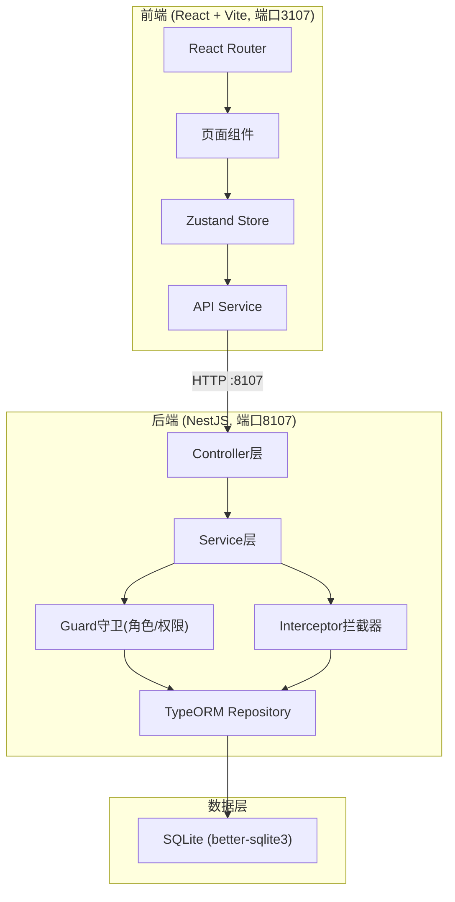
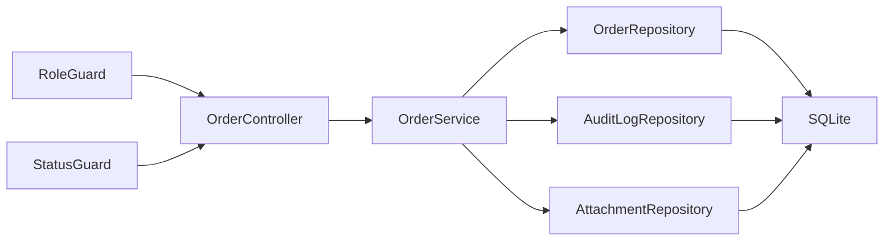
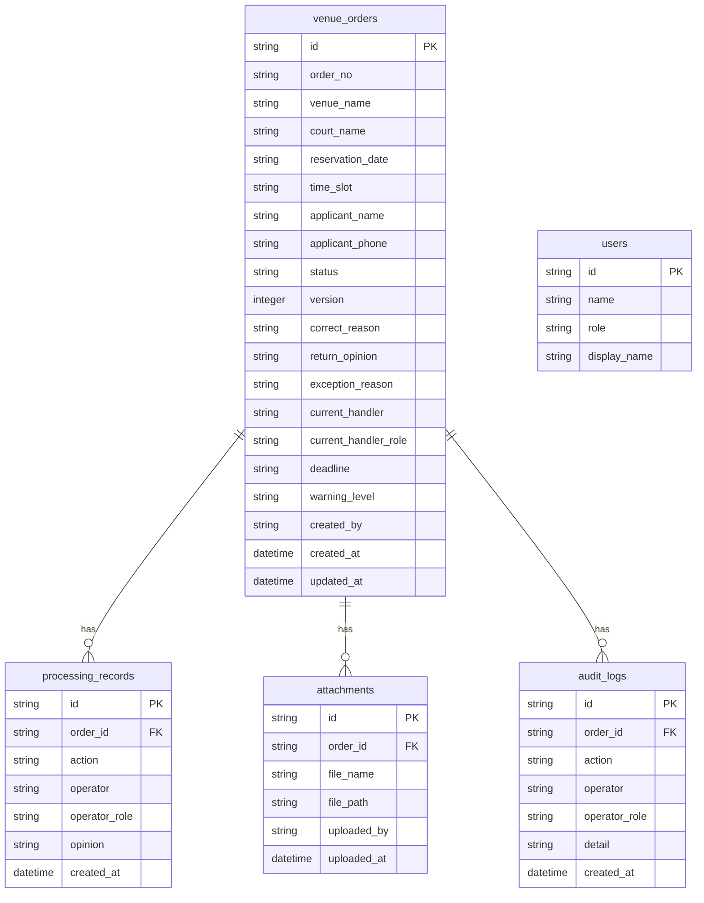

## 1. 架构设计



## 2. 技术说明
- 前端：React@18 + TypeScript + Vite + TailwindCSS + Zustand + React Router
- 初始化工具：vite-init
- 后端：NestJS + TypeScript + TypeORM + better-sqlite3
- 数据库：SQLite (本地文件 venue_orders.db)
- 端口：前端 3107，后端 8107
- CORS：白名单 http://localhost:3107

## 3. 路由定义
| 路由 | 用途 |
|------|------|
| / | 首页/角色选择 |
| /orders | 订单列表（含筛选、批量处理） |
| /orders/new | 新增订单 |
| /orders/:id | 订单详情（含办理/复核操作） |
| /warnings | 到期预警看板 |
| /audit | 审计日志 |

## 4. API定义

### 4.1 认证/角色
```
POST   /api/auth/switch-role       切换当前角色
GET    /api/auth/current-role      获取当前角色
```

### 4.2 场地订单
```
GET    /api/orders                  获取订单列表（支持状态/角色/到期筛选）
GET    /api/orders/:id              获取订单详情
POST   /api/orders                  新增订单
PUT    /api/orders/:id/correct      补正订单
PUT    /api/orders/:id/review       审核办理
PUT    /api/orders/:id/approve      复核归档
PUT    /api/orders/:id/return       退回
POST   /api/orders/batch-review     批量审核
POST   /api/orders/batch-approve    批量复核
GET    /api/orders/warnings         到期预警列表
```

### 4.3 审计日志
```
GET    /api/audit-logs              获取审计日志
```

### 4.4 附件
```
POST   /api/attachments             上传附件
GET    /api/attachments/:id         下载附件
```

### 4.5 核心TypeScript类型
```typescript
enum OrderStatus {
  PENDING_REVIEW = 'pending_review',
  PENDING_CORRECTION = 'pending_correction',
  UNDER_REVIEW = 'under_review',
  UNDER_APPROVAL = 'under_approval',
  COMPLETED = 'completed',
  OVERDUE = 'overdue',
}

enum UserRole {
  REGISTRAR = 'registrar',
  REVIEWER = 'reviewer',
  APPROVER = 'approver',
}

enum WarningLevel {
  NORMAL = 'normal',
  APPROACHING = 'approaching',
  OVERDUE = 'overdue',
}

interface VenueOrder {
  id: string;
  orderNo: string;
  venueName: string;
  courtName: string;
  reservationDate: string;
  timeSlot: string;
  applicantName: string;
  applicantPhone: string;
  status: OrderStatus;
  version: number;
  correctReason: string | null;
  returnOpinion: string | null;
  exceptionReason: string | null;
  currentHandler: string;
  currentHandlerRole: UserRole;
  deadline: string;
  warningLevel: WarningLevel;
  createdBy: string;
  createdAt: string;
  updatedAt: string;
}

interface ProcessingRecord {
  id: string;
  orderId: string;
  action: string;
  operator: string;
  operatorRole: UserRole;
  opinion: string;
  createdAt: string;
}

interface Attachment {
  id: string;
  orderId: string;
  fileName: string;
  filePath: string;
  uploadedBy: string;
  uploadedAt: string;
}

interface AuditLog {
  id: string;
  orderId: string;
  action: string;
  operator: string;
  operatorRole: UserRole;
  detail: string;
  createdAt: string;
}

interface BatchResult {
  orderId: string;
  orderNo: string;
  success: boolean;
  reason: string;
}
```

## 5. 服务端架构图



## 6. 数据模型

### 6.1 数据模型定义



### 6.2 数据定义语言

```sql
CREATE TABLE users (
  id TEXT PRIMARY KEY,
  name TEXT NOT NULL,
  role TEXT NOT NULL,
  display_name TEXT NOT NULL
);

CREATE TABLE venue_orders (
  id TEXT PRIMARY KEY,
  order_no TEXT NOT NULL UNIQUE,
  venue_name TEXT NOT NULL,
  court_name TEXT NOT NULL,
  reservation_date TEXT NOT NULL,
  time_slot TEXT NOT NULL,
  applicant_name TEXT NOT NULL,
  applicant_phone TEXT NOT NULL,
  status TEXT NOT NULL DEFAULT 'pending_review',
  version INTEGER NOT NULL DEFAULT 1,
  correct_reason TEXT,
  return_opinion TEXT,
  exception_reason TEXT,
  current_handler TEXT NOT NULL,
  current_handler_role TEXT NOT NULL,
  deadline TEXT NOT NULL,
  warning_level TEXT NOT NULL DEFAULT 'normal',
  created_by TEXT NOT NULL,
  created_at TEXT NOT NULL DEFAULT (datetime('now')),
  updated_at TEXT NOT NULL DEFAULT (datetime('now'))
);

CREATE TABLE processing_records (
  id TEXT PRIMARY KEY,
  order_id TEXT NOT NULL,
  action TEXT NOT NULL,
  operator TEXT NOT NULL,
  operator_role TEXT NOT NULL,
  opinion TEXT,
  created_at TEXT NOT NULL DEFAULT (datetime('now')),
  FOREIGN KEY (order_id) REFERENCES venue_orders(id)
);

CREATE TABLE attachments (
  id TEXT PRIMARY KEY,
  order_id TEXT NOT NULL,
  file_name TEXT NOT NULL,
  file_path TEXT NOT NULL,
  uploaded_by TEXT NOT NULL,
  uploaded_at TEXT NOT NULL DEFAULT (datetime('now')),
  FOREIGN KEY (order_id) REFERENCES venue_orders(id)
);

CREATE TABLE audit_logs (
  id TEXT PRIMARY KEY,
  order_id TEXT NOT NULL,
  action TEXT NOT NULL,
  operator TEXT NOT NULL,
  operator_role TEXT NOT NULL,
  detail TEXT,
  created_at TEXT NOT NULL DEFAULT (datetime('now')),
  FOREIGN KEY (order_id) REFERENCES venue_orders(id)
);

-- 种子数据：三个角色用户
INSERT INTO users (id, name, role, display_name) VALUES
  ('u1', 'zhangwei', 'registrar', '张伟（场馆前台）'),
  ('u2', 'liming', 'reviewer', '李明（运营主管）'),
  ('u3', 'wangfang', 'approver', '王芳（场馆经理）');

-- 种子数据：演示订单覆盖三类流转
INSERT INTO venue_orders (id, order_no, venue_name, court_name, reservation_date, time_slot, applicant_name, applicant_phone, status, version, correct_reason, return_opinion, exception_reason, current_handler, current_handler_role, deadline, warning_level, created_by) VALUES
  ('o1', 'VD20250601001', '市体育中心', '篮球馆A场', '2025-06-15', '09:00-11:00', '赵强', '13800001111', 'pending_correction', 1, '缺少支付凭证', NULL, NULL, 'u1', 'registrar', '2025-06-10', 'approaching', 'u1'),
  ('o2', 'VD20250601002', '市体育中心', '游泳馆', '2025-06-16', '14:00-16:00', '孙丽', '13800002222', 'under_approval', 2, NULL, NULL, NULL, 'u3', 'approver', '2025-06-12', 'normal', 'u1'),
  ('o3', 'VD20250601003', '区全民健身中心', '羽毛球馆3号', '2025-06-14', '10:00-12:00', '周杰', '13800003333', 'completed', 3, NULL, NULL, NULL, 'u3', 'approver', '2025-06-08', 'normal', 'u1');
