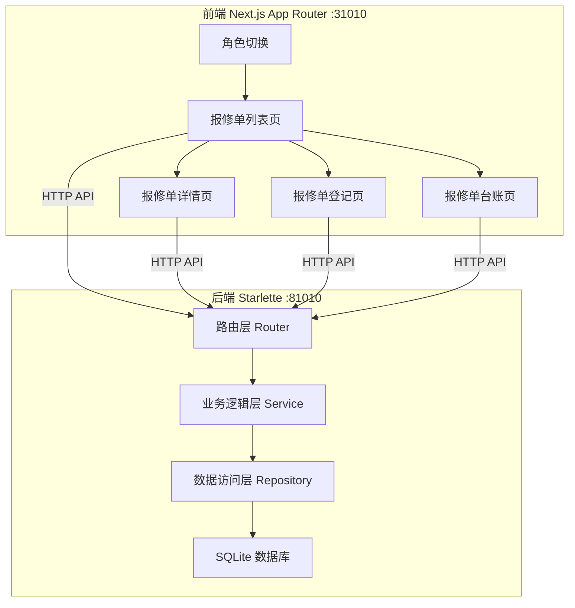
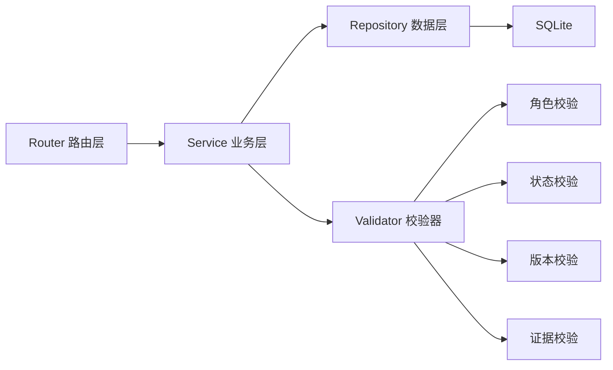
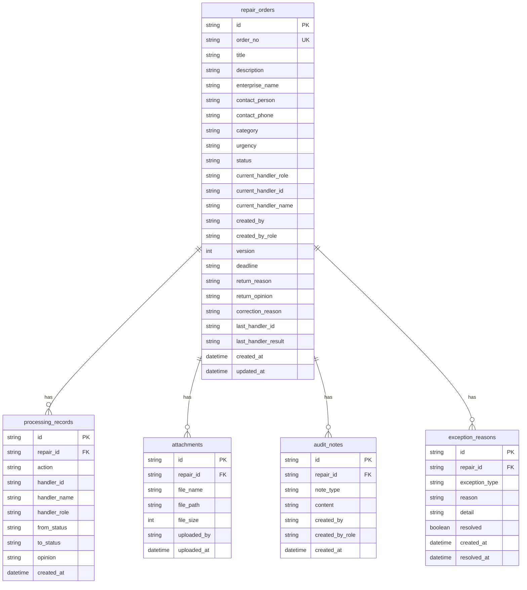

## 1. 架构设计


## 2. 技术说明
- 前端：Next.js 14 App Router + TypeScript + Tailwind CSS + Zustand
- 后端：Python 3.11+ + Starlette + Uvicorn
- 数据库：SQLite (本地文件 db/repair.db)
- 端口：前端 31010，后端 81010
- CORS：白名单 http://localhost:31010

## 3. 路由定义
| 路由 | 用途 |
|------|------|
| / | 首页，报修单列表 |
| /register | 报修单登记页 |
| /ledger | 报修单台账页 |
| /repair/[id] | 报修单详情页 |

## 4. API定义

### 4.1 报修单管理
| 方法 | 路径 | 用途 |
|------|------|------|
| GET | /api/repairs | 获取报修单列表（支持筛选、分页） |
| GET | /api/repairs/:id | 获取报修单详情 |
| POST | /api/repairs | 创建报修单 |
| PUT | /api/repairs/:id | 更新报修单（仅待提交/已退回状态） |
| POST | /api/repairs/:id/submit | 提交报修单 |
| POST | /api/repairs/:id/process | 工程主管受理处理 |
| POST | /api/repairs/:id/verify | 工程主管核验 |
| POST | /api/repairs/:id/review | 园区经理复核 |
| POST | /api/repairs/:id/archive | 园区经理归档 |
| POST | /api/repairs/:id/return | 退回报修单 |
| POST | /api/repairs/:id/resubmit | 重新提交报修单 |

### 4.2 批量操作
| 方法 | 路径 | 用途 |
|------|------|------|
| POST | /api/repairs/batch/advance | 批量推进 |
| POST | /api/repairs/batch/return | 批量退回 |

### 4.3 台账与预警
| 方法 | 路径 | 用途 |
|------|------|------|
| GET | /api/ledger | 台账列表（含派单状态、确认状态） |
| GET | /api/repairs/warnings | 到期预警分组 |

### 4.4 附件
| 方法 | 路径 | 用途 |
|------|------|------|
| POST | /api/attachments | 上传附件 |
| GET | /api/attachments/:id | 下载附件 |

### 4.5 处理记录
| 方法 | 路径 | 用途 |
|------|------|------|
| GET | /api/repairs/:id/records | 获取处理记录 |
| GET | /api/repairs/:id/exceptions | 获取异常原因 |

### 4.6 核心数据结构
```typescript
interface RepairOrder {
  id: string
  order_no: string
  title: string
  description: string
  enterprise_name: string
  contact_person: string
  contact_phone: string
  category: string
  urgency: "normal" | "urgent"
  status: "pending_submit" | "pending_process" | "processing" | "pending_verify" | "pending_review" | "pending_archive" | "archived" | "returned" | "resubmitted"
  current_handler_role: "enterprise_service" | "engineering_supervisor" | "park_manager"
  current_handler_id: string
  current_handler_name: string
  created_by: string
  created_by_role: string
  version: number
  deadline: string
  return_reason: string | null
  return_opinion: string | null
  correction_reason: string | null
  last_handler_id: string | null
  last_handler_result: string | null
  created_at: string
  updated_at: string
}

interface ProcessingRecord {
  id: string
  repair_id: string
  action: string
  handler_id: string
  handler_name: string
  handler_role: string
  from_status: string
  to_status: string
  opinion: string | null
  attachments: string[]
  created_at: string
}

interface Attachment {
  id: string
  repair_id: string
  file_name: string
  file_path: string
  file_size: number
  uploaded_by: string
  uploaded_at: string
}

interface AuditNote {
  id: string
  repair_id: string
  note_type: "info" | "warning" | "error"
  content: string
  created_by: string
  created_by_role: string
  created_at: string
}

interface ExceptionReason {
  id: string
  repair_id: string
  exception_type: "timeout" | "status_conflict" | "missing_evidence" | "version_conflict" | "permission_denied"
  reason: string
  detail: string
  resolved: boolean
  created_at: string
  resolved_at: string | null
}
```

### 4.7 接口校验规则
1. **角色校验**：检查当前角色是否有权执行操作
2. **当前处理人校验**：检查当前用户是否为报修单的处理人
3. **状态校验**：检查报修单当前状态是否允许该操作
4. **版本校验**：提交时携带版本号，与服务端不匹配则拒绝(乐观锁)
5. **必填证据校验**：核验/复核/归档时检查必须上传附件
6. **退回补正校验**：重新提交时必须填写补正原因，退回时必须填写退回意见
7. **上一处理人结果校验**：退回/重新提交时检查上一处理人的处理结果

## 5. 服务架构图


## 6. 数据模型

### 6.1 数据模型图


### 6.2 数据定义语言
```sql
CREATE TABLE repair_orders (
    id TEXT PRIMARY KEY,
    order_no TEXT UNIQUE NOT NULL,
    title TEXT NOT NULL,
    description TEXT NOT NULL,
    enterprise_name TEXT NOT NULL,
    contact_person TEXT NOT NULL,
    contact_phone TEXT NOT NULL,
    category TEXT NOT NULL,
    urgency TEXT NOT NULL DEFAULT 'normal',
    status TEXT NOT NULL DEFAULT 'pending_submit',
    current_handler_role TEXT NOT NULL,
    current_handler_id TEXT NOT NULL,
    current_handler_name TEXT NOT NULL,
    created_by TEXT NOT NULL,
    created_by_role TEXT NOT NULL,
    version INTEGER NOT NULL DEFAULT 1,
    deadline TEXT NOT NULL,
    return_reason TEXT,
    return_opinion TEXT,
    correction_reason TEXT,
    last_handler_id TEXT,
    last_handler_result TEXT,
    created_at TEXT NOT NULL DEFAULT (datetime('now')),
    updated_at TEXT NOT NULL DEFAULT (datetime('now'))
);

CREATE TABLE processing_records (
    id TEXT PRIMARY KEY,
    repair_id TEXT NOT NULL REFERENCES repair_orders(id),
    action TEXT NOT NULL,
    handler_id TEXT NOT NULL,
    handler_name TEXT NOT NULL,
    handler_role TEXT NOT NULL,
    from_status TEXT NOT NULL,
    to_status TEXT NOT NULL,
    opinion TEXT,
    created_at TEXT NOT NULL DEFAULT (datetime('now'))
);

CREATE TABLE attachments (
    id TEXT PRIMARY KEY,
    repair_id TEXT NOT NULL REFERENCES repair_orders(id),
    file_name TEXT NOT NULL,
    file_path TEXT NOT NULL,
    file_size INTEGER NOT NULL,
    uploaded_by TEXT NOT NULL,
    uploaded_at TEXT NOT NULL DEFAULT (datetime('now'))
);

CREATE TABLE audit_notes (
    id TEXT PRIMARY KEY,
    repair_id TEXT NOT NULL REFERENCES repair_orders(id),
    note_type TEXT NOT NULL,
    content TEXT NOT NULL,
    created_by TEXT NOT NULL,
    created_by_role TEXT NOT NULL,
    created_at TEXT NOT NULL DEFAULT (datetime('now'))
);

CREATE TABLE exception_reasons (
    id TEXT PRIMARY KEY,
    repair_id TEXT NOT NULL REFERENCES repair_orders(id),
    exception_type TEXT NOT NULL,
    reason TEXT NOT NULL,
    detail TEXT NOT NULL,
    resolved INTEGER NOT NULL DEFAULT 0,
    created_at TEXT NOT NULL DEFAULT (datetime('now')),
    resolved_at TEXT
);

CREATE INDEX idx_repair_orders_status ON repair_orders(status);
CREATE INDEX idx_repair_orders_deadline ON repair_orders(deadline);
CREATE INDEX idx_repair_orders_handler ON repair_orders(current_handler_id, current_handler_role);
CREATE INDEX idx_processing_records_repair ON processing_records(repair_id);
CREATE INDEX idx_attachments_repair ON attachments(repair_id);
CREATE INDEX idx_audit_notes_repair ON audit_notes(repair_id);
CREATE INDEX idx_exception_reasons_repair ON exception_reasons(repair_id);
CREATE INDEX idx_exception_reasons_resolved ON exception_reasons(resolved);
```
